---
## Front matter
lang: ru-RU
title: Отчёт по выполнению лабораторной работы №1
subtitle: Установка и настройка Fedora Sway
author:
  - Коровкин Н. М.
institute:
  - Российский университет дружбы народов, Москва, Россия
date: 24 февраля 2025

## i18n babel
babel-lang: russian
babel-otherlangs: english

## Formatting pdf
toc: false
toc-title: Содержание
slide_level: 2
aspectratio: 169
section-titles: true
theme: metropolis
header-includes:
 - \metroset{progressbar=frametitle,sectionpage=progressbar,numbering=fraction}
 - '\makeatletter'
 - '\beamer@ignorenonframefalse'
 - '\makeatother'
 
## Fonts
mainfont: PT Serif
romanfont: PT Serif
sansfont: PT Sans
monofont: PT Mono
mainfontoptions: Ligatures=TeX
romanfontoptions: Ligatures=TeX
sansfontoptions: Ligatures=TeX,Scale=MatchLowercase
monofontoptions: Scale=MatchLowercase,Scale=0.9
---

# Информация

## Докладчик

:::::::::::::: {.columns align=center}
::: {.column width="70%"}

  * Коровкин Никита Михайлович
  * Студент
  * Российский университет дружбы народов
  * [1132246835@pfur.ru](mailto:1132246835@pfur.ru)

:::
::: {.column width="30%"}

:::
::::::::::::::

## Цель

Целью данной работы является приобретение практических навыков установки операционной системы на виртуальную машину, настройки минимально необходимых для дальнейшей работы сервисов.

## Задание

Установка операционной системы 
Установка драйверов для VirtualBox 
Настройка раскладки клавиатуры 
Установка имени пользователя и названия хоста 
Подключение общей папки
Установка программного обеспечения для создания документации 
Домашнее задание

## Установка Fedora Sway

В первую очередь нам необходимо создать виртуальную машину. Она уже была создана во время предыдущего семестра с помощью utm.

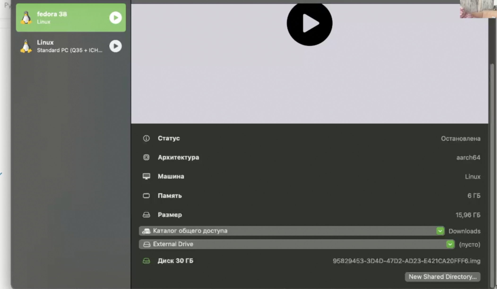{width=70%}

## Установка Fedora Sway

Теперь войдем в наш имеющийся заранее аккаунт.

{width=70%}

## Установка Fedora Sway

Теперь установим менеджер окон  sway 

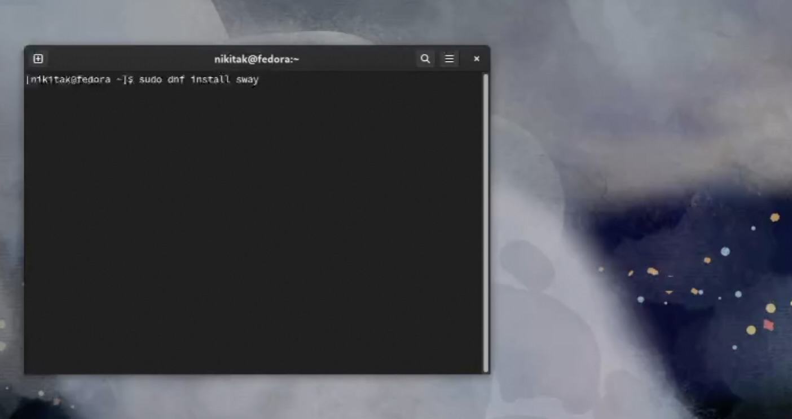{ width=70%}

## Переход в режим суперпользователя

После этого нам необходимо получить особые права пользователя.

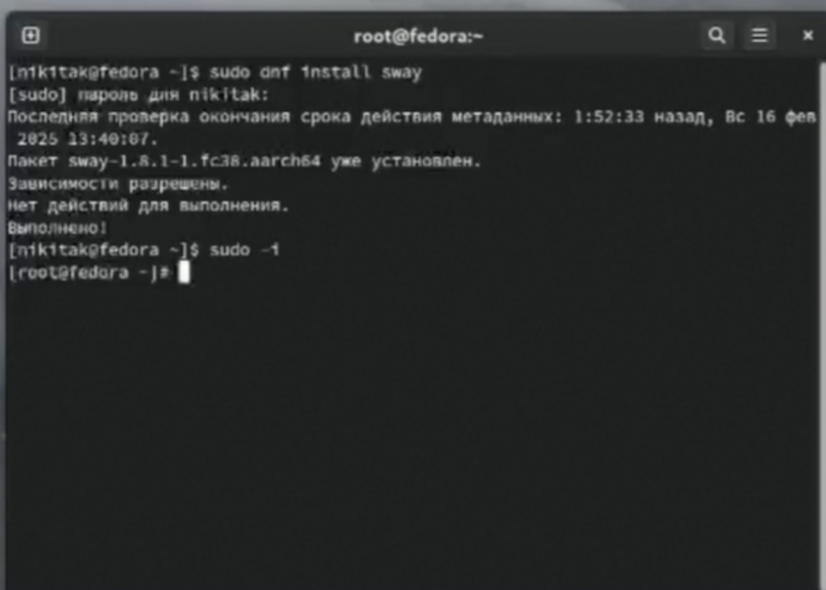{width=70%}

## Обновление всех пакетов

Обновим все пакеты с помощью dnf.

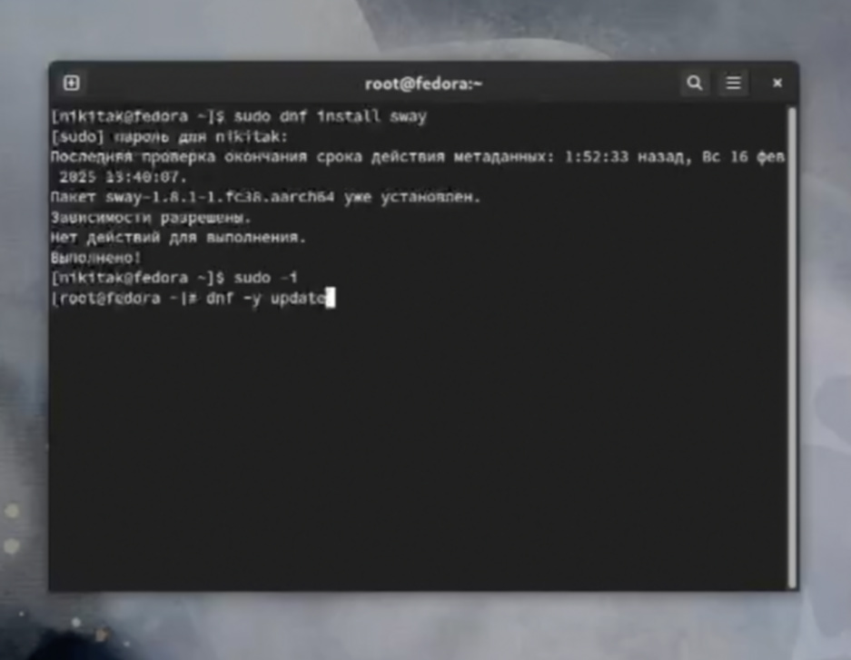{width=70%}

## Повышение комфорта работы

Установим  tmux с помощью dnf. Все остальные программы также в основном устанавливаются через dnf.

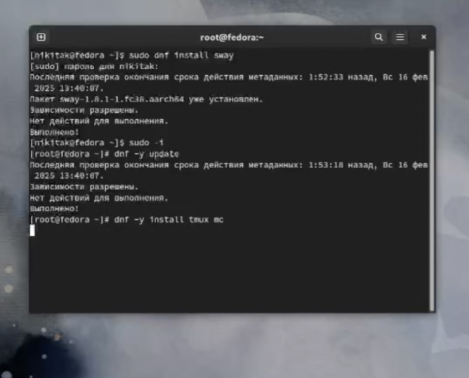{width=70%}

## Повышение комфорта работы

Установим dnf-automatic.

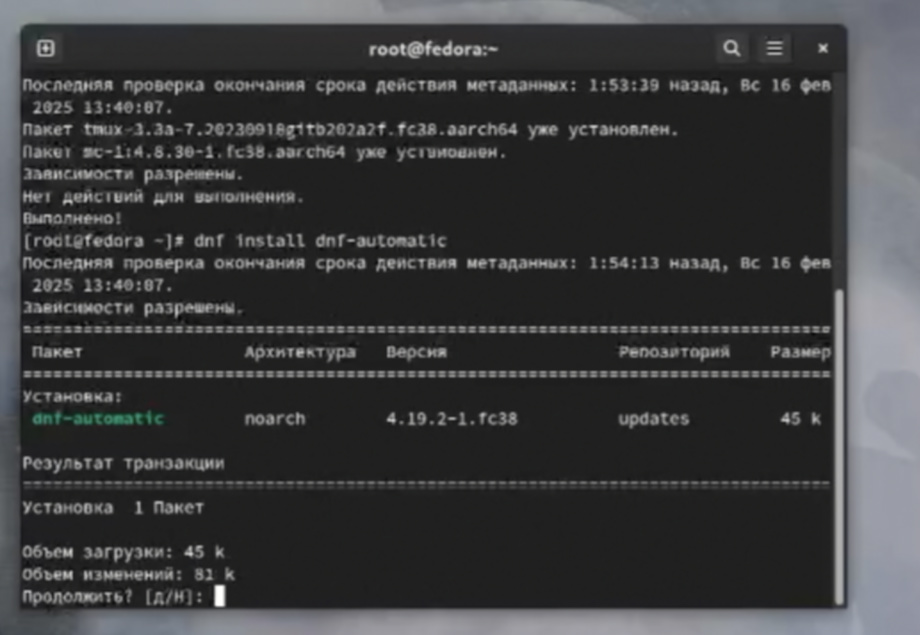{width=70%}

## Настройка раскладки клавиатуры
Теперь нам нужно будет работать с файлом конфигурации клавиатуры.

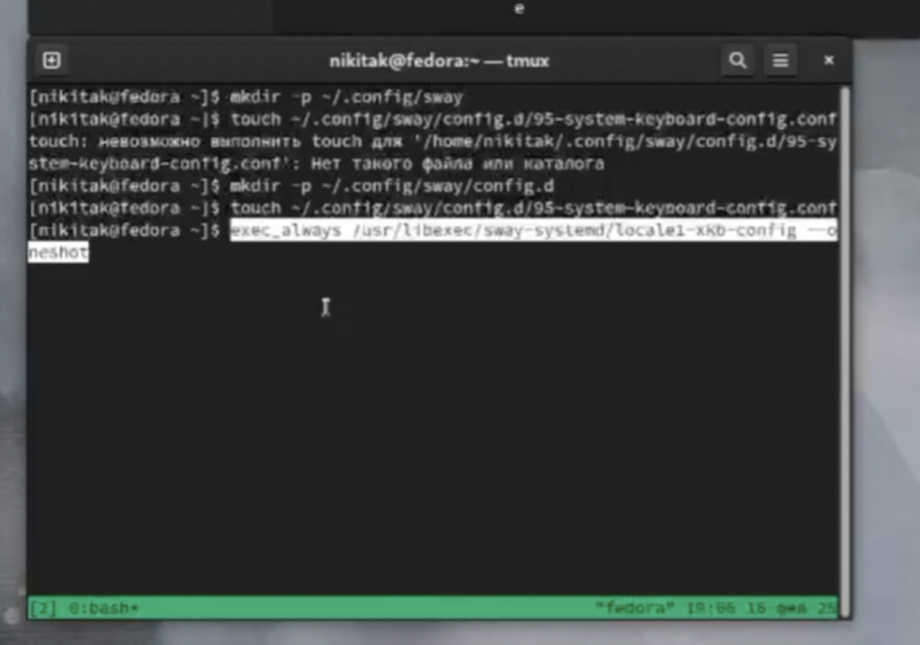{width=70%}

## Настройка раскладки клавиатуры

Вставим следующую строчку в созданный нами файл.

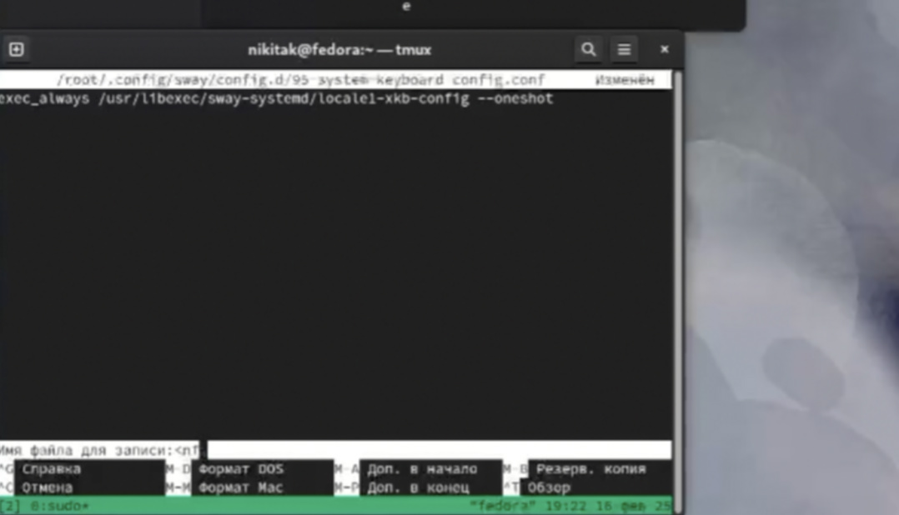{ width=70%}

## Настройка раскладки клавиатуры
Редактируем еще один файл.

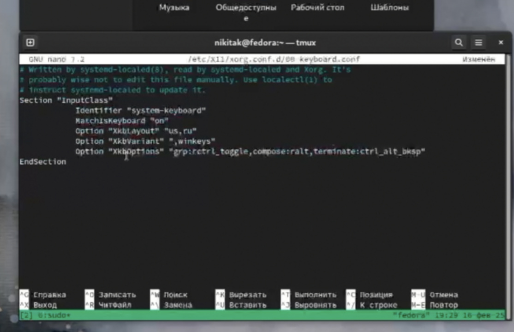{ width=70%}

## Настройка раскладки клавиатуры

Перезагружаем систему.

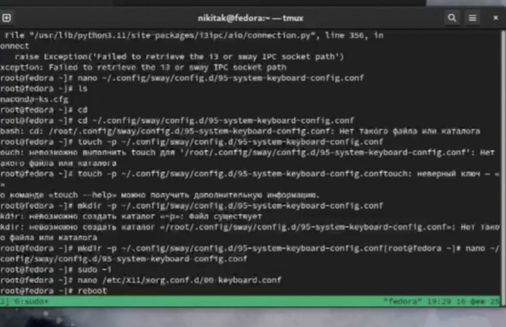{ width=70%}

## Добавляем хост и пользователя

Теперь добавим пользователя.

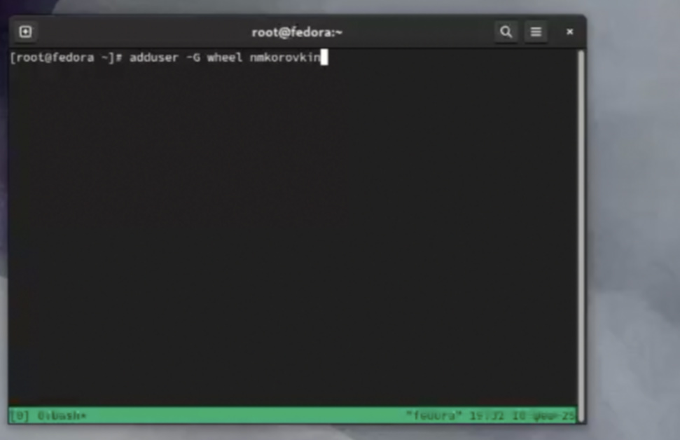{ width=70%}

## Добавляем хост и пользователя

Заполним имя и пароль.

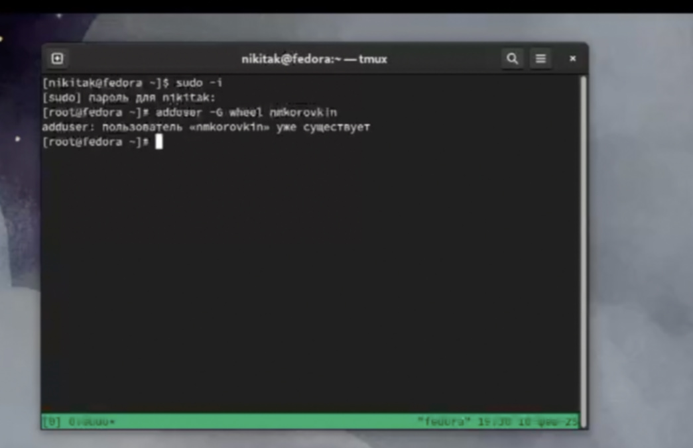{ width=70%}

## Добавляем хост и пользователя

Установим хост.

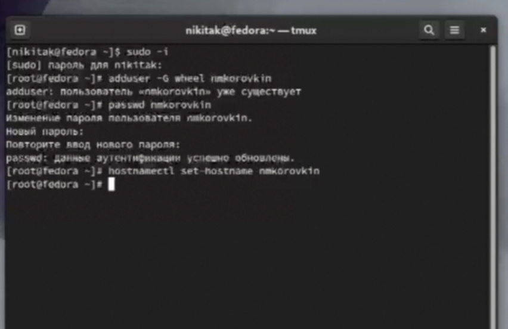{ width=70%}

## Добавляем хост и пользователя

Проверим, получилось ли.

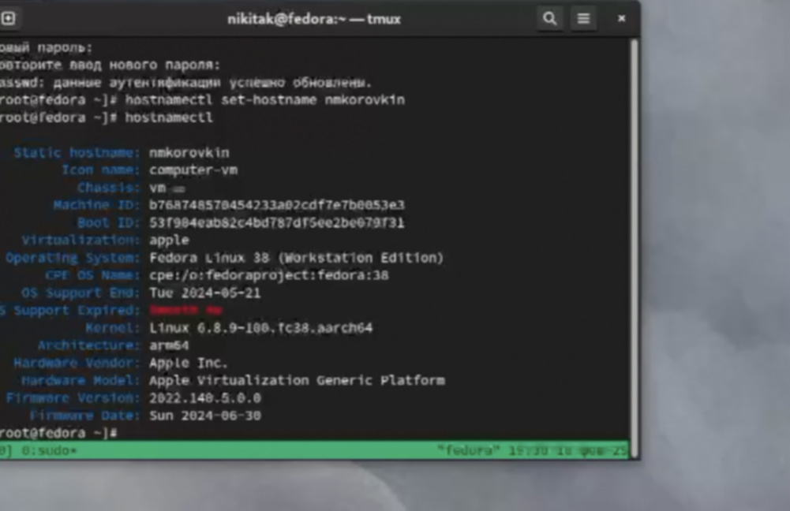{ width=70%}

## Проверка установки Pandoc

Далее нам нужно установить Pandoc и Texlive.Так как они уже были установлены в предыдущем семестре, проверим точно ли они у нас есть.

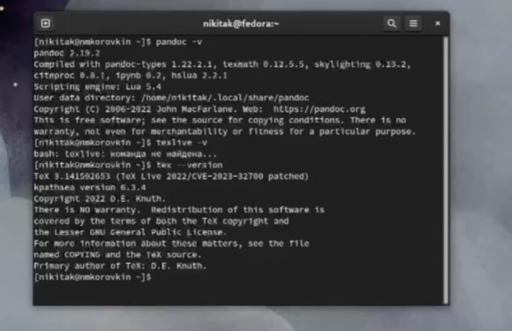{ width=70%}

Все верно.

#Домашнее задание

Теперь предстоит проверить версию ядра, гипервизор, модель процессора, его частоту и количество оперативной памяти.

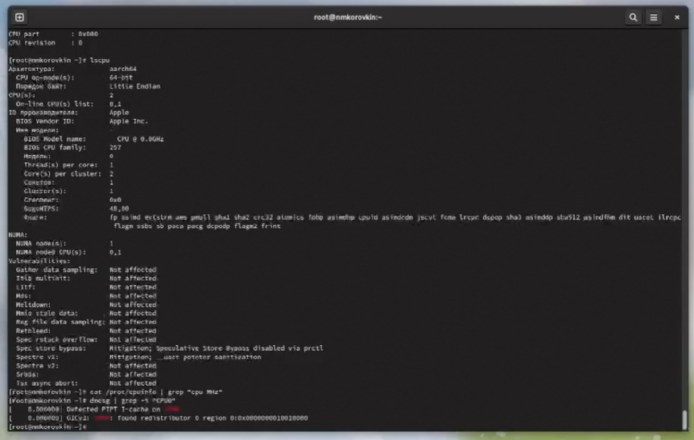{#fig:017 width=70%}

Некоторые команды не сработали из-за особенностей чипа m2.

Работа выполнена верно.

#Выводы

В ходе выполнения работы Были получены навыки работы  и знания о  системе Fedora Sway, была проведена установка системы, установлены все  необходимые для последующей работы пакеты и произведена базовая настройка системы.
