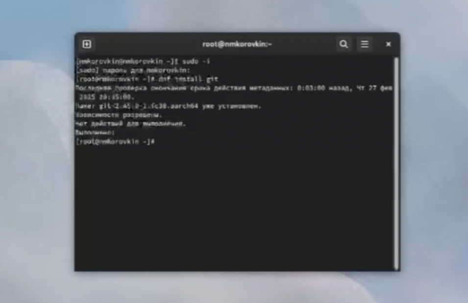
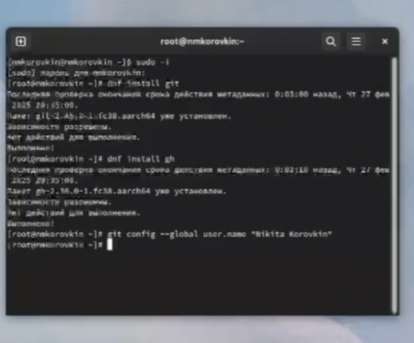
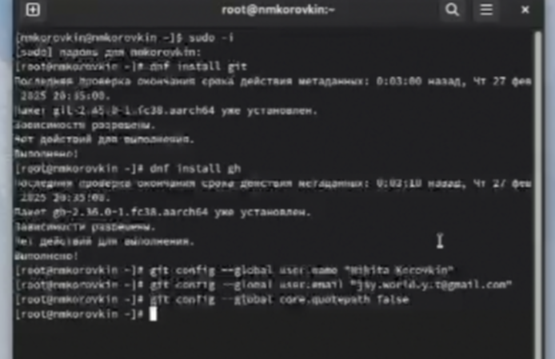
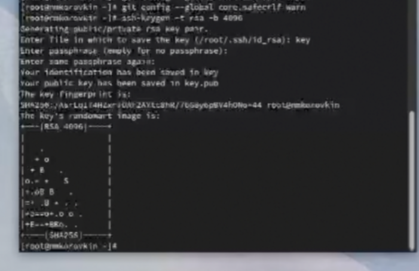
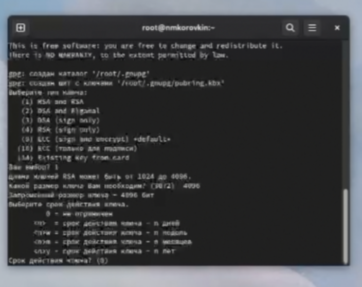
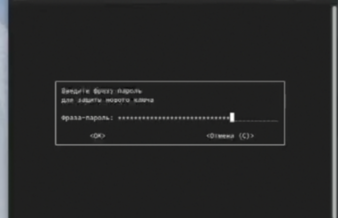
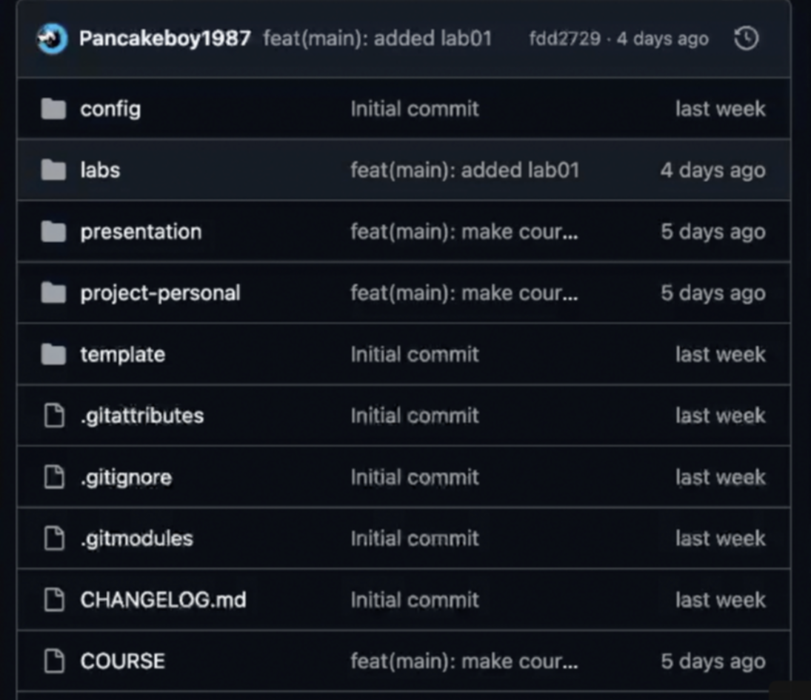

---
## Front matter
lang: ru-RU
title: Лабораторная работа №2
subtitle: Презентация
author:
  - Коровкин Н. М.
institute:
  - Российский университет дружбы народов, Москва, Россия
date: 25 февраля 2024

## i18n babel
babel-lang: russian
babel-otherlangs: english

## Formatting pdf
toc: false
toc-title: Содержание
slide_level: 2
aspectratio: 169
section-titles: true
theme: metropolis
header-includes:
 - \metroset{progressbar=frametitle,sectionpage=progressbar,numbering=fraction}
 - '\makeatletter'
 - '\beamer@ignorenonframefalse'
 - '\makeatother'
 
## Fonts
mainfont: PT Serif
romanfont: PT Serif
sansfont: PT Sans
monofont: PT Mono
mainfontoptions: Ligatures=TeX
romanfontoptions: Ligatures=TeX
sansfontoptions: Ligatures=TeX,Scale=MatchLowercase
monofontoptions: Scale=MatchLowercase,Scale=0.9
---

# Информация

## Докладчик

:::::::::::::: {.columns align=center}
::: {.column width="70%"}

  * Коровкин Никита Михайлович
  * Студент
  * Российский университет дружбы народов
  * [1132246835@pfur.ru](mailto:1132246835@pfur.ru)

:::
::: {.column width="30%"}

:::
::::::::::::::

## Цель

Изучить идеологию и применение средств контроля версий.
Освоить умения по работе с git

## Задачи

Создать базовую конфигурацию для работы с git.
Создать ключ SSH.
Создать ключ PGP.
Настроить подписи git.
Зарегистрироваться на Github.
Создать локальный каталог для выполнения заданий по предмету.

## Установка git
Для начала установим  git. Я установил его заранее, поэтому проверим его наличие и версию.(рис.1)

## Установка gh

Теперь установим gh или проверим его наличие (рис. 2)

## Базовая настройка git
Теперь установим имя владельца репозитория. Я использую свое имя (рис. 3)

## Базовая настройка git

Теперь зададим почту и настроим кодировку utf8 в выводе сообщений git. (рис.4)

## Базовая настройка git

Зададим имя начальной ветки, настроим параметры autocrlf и safecrlf (рис. 5)

## Создание ключа ssh

Далее создадим SSH ключ для подключения.(рис.6)

## Создание ключа pgp

Теперь нам нужно создать gpg ключи Выбираем из предложенных вариантов первый тип (RSA and RSA), размер ключа задаём 4096 бит и делаем срок действия ключа неограниченным(рис.7)

## Создание ключа pgp

После введение Имени и почты, введем пароль для защиты наших ключей.(рис.8)

## Добавление PGP ключа в GitHub

Затем авторизируемся на GitHub  любым способом. Я буду делать это через браузер(рис.9)

## Настройка автоматических подписей коммитов git

Теперь настроим автоматические подписи коммитов.(рис. 10)

## Создание репозитория курса на основе шаблона

Далее нам необходимо создать репозиторий и загрузить его на сервер. Этот этап я пропущу, так как репозиторий уже был создан.

Приложу фото репозитория на операционной системе(рис. 11)

## Создание репозитория курса на основе шаблона

Репозиторий на сервере(рис.12)

## Выводы

Была произведена установка git, проведена его первоначальная настройка, были созданы ключи для авторизации и подписи, а также создан репозиторий курса из предложенного шаблона

