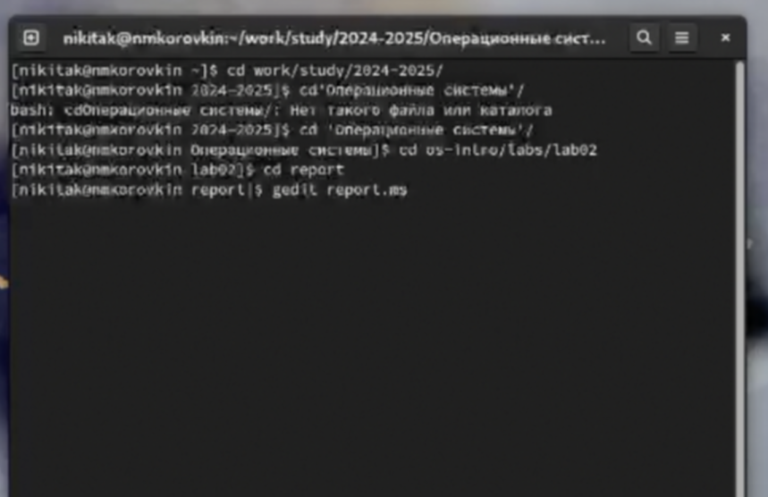
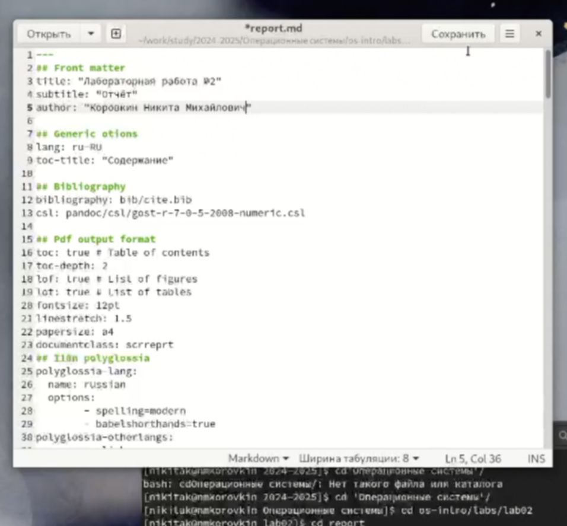
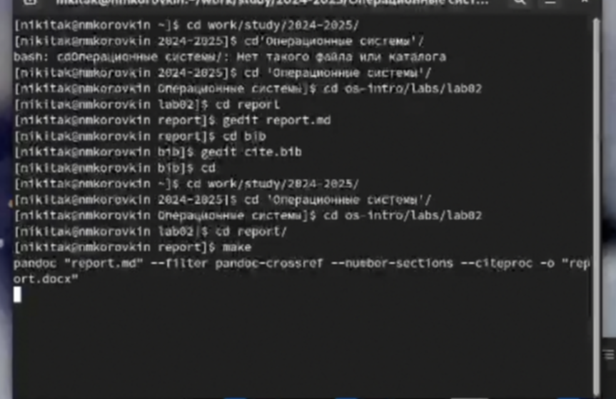
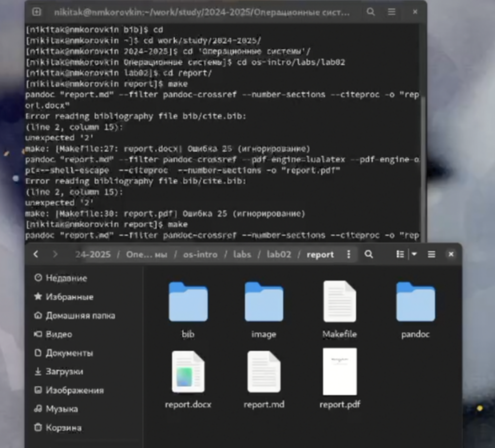

---
## Front matter
lang: ru-RU
title: Лабораторная работа №3
subtitle: Презентация
author:
  - Коровкин Н.М
institute:
  - Российский университет дружбы народов, Москва, Россия
date: 3 марта 2025

## i18n babel
babel-lang: russian
babel-otherlangs: english

## Formatting pdf
toc: false
toc-title: Содержание
slide_level: 2
aspectratio: 169
section-titles: true
theme: metropolis
header-includes:
 - \metroset{progressbar=frametitle,sectionpage=progressbar,numbering=fraction}
 - '\makeatletter'
 - '\beamer@ignorenonframefalse'
 - '\makeatother'
 
## Fonts
mainfont: PT Serif
romanfont: PT Serif
sansfont: PT Sans
monofont: PT Mono
mainfontoptions: Ligatures=TeX
romanfontoptions: Ligatures=TeX
sansfontoptions: Ligatures=TeX,Scale=MatchLowercase
monofontoptions: Scale=MatchLowercase,Scale=0.9
---

# Информация

## Докладчик

:::::::::::::: {.columns align=center}
::: {.column width="70%"}

  * Коровкин Никита Михайлович
  * Студент
  * Российский университет дружбы народов
  * [1132246835@pfur.ru](mailto:1132246835@pfur.ru)

:::
::: {.column width="30%"}

:::
::::::::::::::

## Цель

Научиться оформлять отчёты с помощью легковесного языка разметки Markdown. 

## Задачи

Сделать отчёт по предыдущей лабораторной работе в формате Markdown.  В качестве отчёта предоставить отчёты в 3 форматах: pdf, docx и md (в архиве,
поскольку он должен содержать скриншоты, Makefile и т.д.)

## Открытие файла report.md

Для начала откроем файл report.md. Я это сделаю с помощью gedit.

## Заполнение титульного листа

Поменяем титульный лист, указав автора отчёта и его название

## Заполнение отчета

Заполним весь отчет по образцу, комментируя каждый этап и прикладывая иллюстрации.

## Заполнение списка литературы

Теперь откроем файл для заполнения списка литературы и укажем ТУИС.

##Создание файлов

Все заполнено. Заходим в терминал и создаем отчет в трех форматах

## Проверка файлов

Проверим: создались ли нужные файлы.

Все верно, работа выполнена успешно.

## Выводы

В ходе выполнения лабораторной работы были получены навыки создания отчётов в формате .md и работы с языком markdown.
