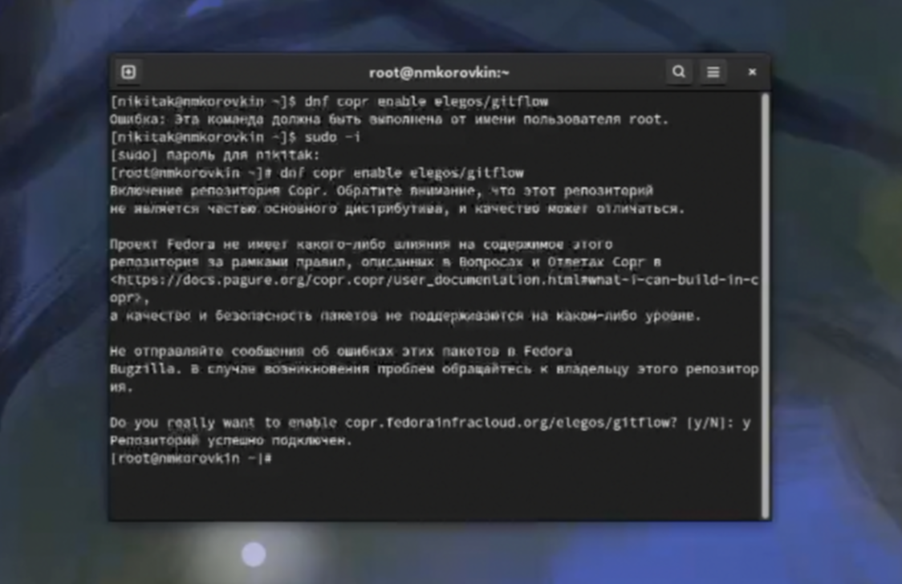
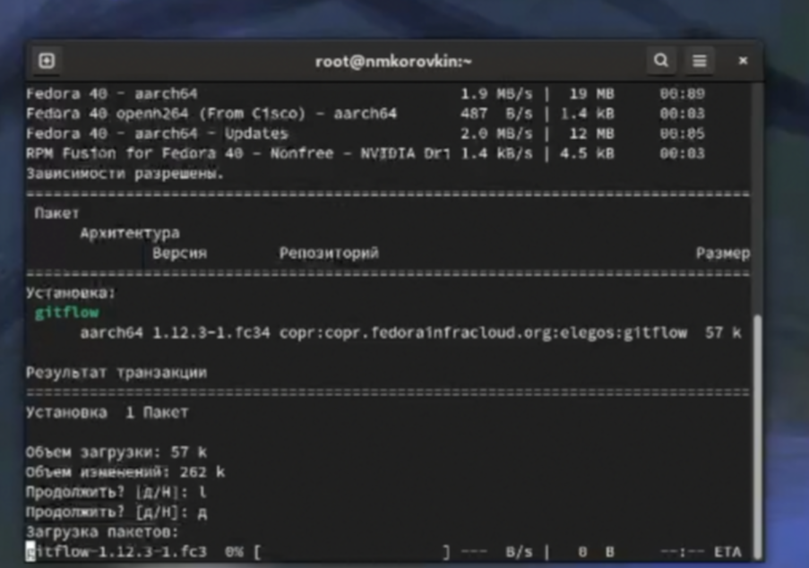
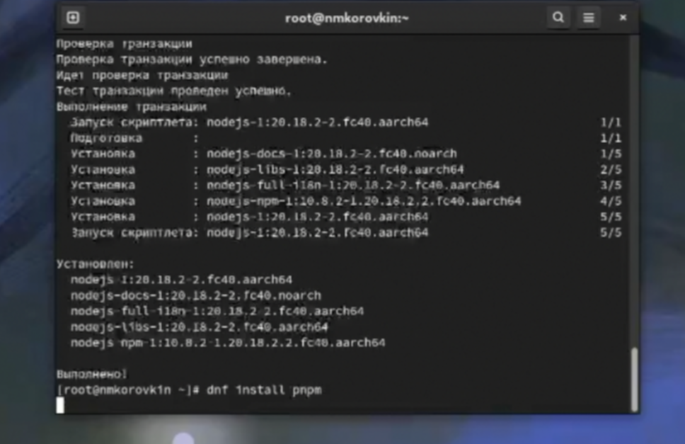
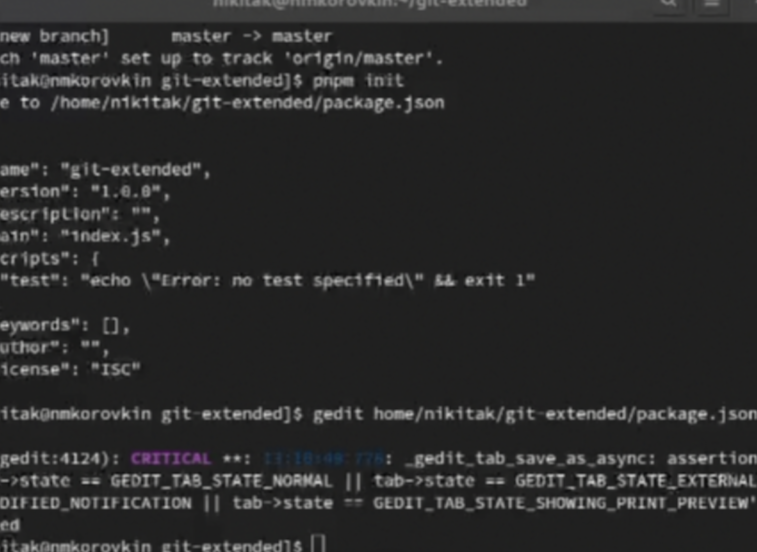
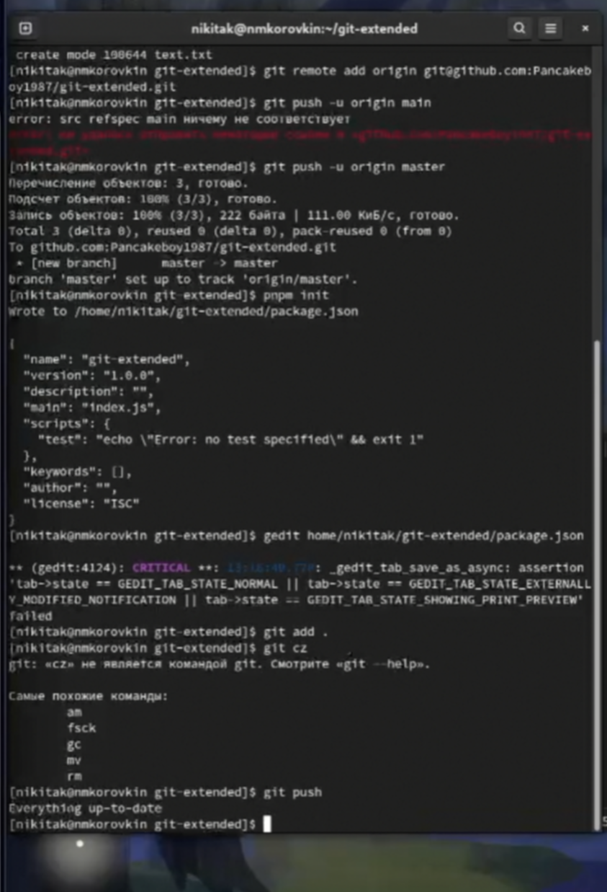
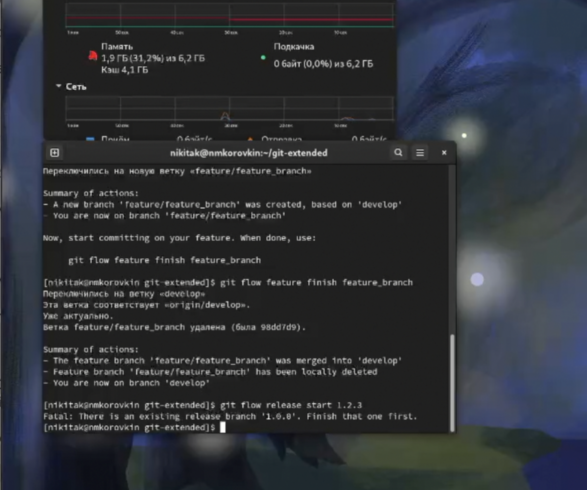
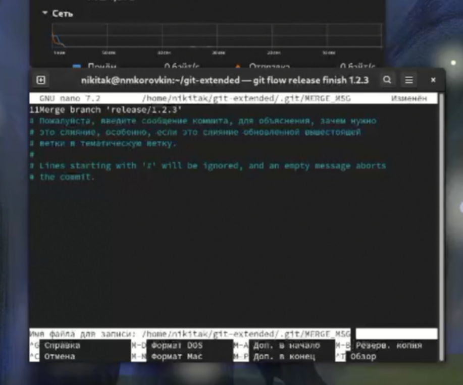
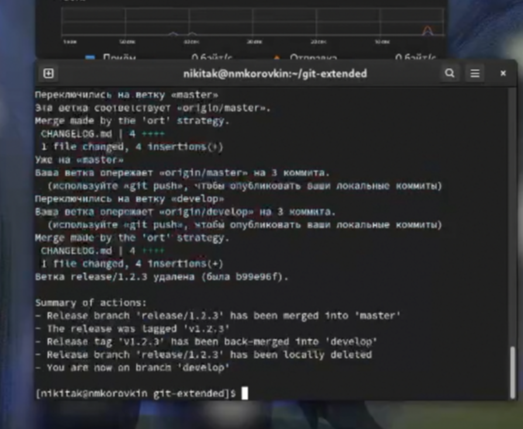

---
## Front matter
lang: ru-RU
title: Лабораторная работа №4
subtitle: Презентация
author:
  - Коровкин Н.М
institute:
  - Российский университет дружбы народов, Москва, Россия
date: 5 марта 2025

## i18n babel
babel-lang: russian
babel-otherlangs: english

## Formatting pdf
toc: false
toc-title: Содержание
slide_level: 2
aspectratio: 169
section-titles: true
theme: metropolis
header-includes:
 - \metroset{progressbar=frametitle,sectionpage=progressbar,numbering=fraction}
 - '\makeatletter'
 - '\beamer@ignorenonframefalse'
 - '\makeatother'
 
## Fonts
mainfont: PT Serif
romanfont: PT Serif
sansfont: PT Sans
monofont: PT Mono
mainfontoptions: Ligatures=TeX
romanfontoptions: Ligatures=TeX
sansfontoptions: Ligatures=TeX,Scale=MatchLowercase
monofontoptions: Scale=MatchLowercase,Scale=0.9
---

# Информация

## Докладчик

:::::::::::::: {.columns align=center}
::: {.column width="70%"}

  * Коровкин Никита Михайлович
  * Студент
  * Российский университет дружбы народов
  * [1132246835@pfur.ru](mailto:1132246835@pfur.ru)

:::
::: {.column width="30%"}

:::
::::::::::::::

## Цель

Получение навыков правильной работы с репозиториями git

## Задание

Выполнить работу для тестового репозитория.
Преобразовать рабочий репозиторий в репозиторий с git-flow и conventional commits.

## Выполнение лабораторной работы

## Подключение репозитория

Для начала  мы подключим репозиторий, из которого можно скачать gitflow 

## У становка
Нам нужно будет установить Git flow

## Установка

Теперь установим node.js

## Установка

Затем устанавливаем pnpm.

## Установка

далее настраиваем  pnpm.

## Установка

И установим с помощью него Commitizen.

## Создаем дрокументы

Создадим тестовый репозиторий git-extended.

## Клонирование

И клонируем его себе на компьютер, а затем  сделаем соответствующий коммит.

Все изменения отправляем на GitHub.

## Редактура

Теперь проинициализируем pnpm.
После инициализации создастся файл package.json, который нужно изменить следующим образом.

## Редактура

Затем делаем коммит и отправляем все на сервер.

## Редактура

Теперь проинициализируем gitflow.

## Редактура

Настроим ветки.

## Редактура

Создаем changelog.

## Редактура

Проиндексируем changelog и сделаем коммит 

## Редактура

Теперь сольём ветку release с веткой develop.

Делаем обновленный релиз и добавляем туда чейнджлог.

## Редактура

{#fig:016}

Добавляем комментарий в коммит.

## Редактура

Сольем ветку с журналом изменений с основной веткой.(

{

## Редактура

Загрузим изменения в гитхаб и создадим релиз

## Выводы

В ходе выполнения лабораторной работы мною были получены навыки работы с расширенными возможностями git, кроме того были созданы релизы к репозиторию и дополнительные ветки, которые автор научился сливать воедино
