---
## Front matter
title: "Лабораторная работа №4"
subtitle: "Отчёт"
author: "Коровкин Никита Михайлович"

## Generic otions
lang: ru-RU
toc-title: "Содержание"

## Bibliography
bibliography: bib/cite.bib
csl: pandoc/csl/gost-r-7-0-5-2008-numeric.csl

## Pdf output format
toc: true # Table of contents
toc-depth: 2
lof: true # List of figures
lot: true # List of tables
fontsize: 12pt
linestretch: 1.5
papersize: a4
documentclass: scrreprt
## I18n polyglossia
polyglossia-lang:
  name: russian
  options:
	- spelling=modern
	- babelshorthands=true
polyglossia-otherlangs:
  name: english
## I18n babel
babel-lang: russian
babel-otherlangs: english
## Fonts
mainfont: PT Serif
romanfont: PT Serif
sansfont: PT Sans
monofont: PT Mono
mainfontoptions: Ligatures=TeX
romanfontoptions: Ligatures=TeX
sansfontoptions: Ligatures=TeX,Scale=MatchLowercase
monofontoptions: Scale=MatchLowercase,Scale=0.9
## Biblatex
biblatex: true
biblio-style: "gost-numeric"
biblatexoptions:
  - parentracker=true
  - backend=biber
  - hyperref=auto
  - language=auto
  - autolang=other*
  - citestyle=gost-numeric
## Pandoc-crossref LaTeX customization
figureTitle: "Рис."
tableTitle: "Таблица"
listingTitle: "Листинг"
lofTitle: "Список иллюстраций"
lotTitle: "Список таблиц"
lolTitle: "Листинги"
## Misc options
indent: true
header-includes:
  - \usepackage{indentfirst}
  - \usepackage{float} # keep figures where there are in the text
  - \floatplacement{figure}{H} # keep figures where there are in the text
---

# Цель работы

Получение навыков правильной работы с репозиториями git [@tuis]

# Задание

Выполнить работу для тестового репозитория.
Преобразовать рабочий репозиторий в репозиторий с git-flow и conventional commits.

# Выполнение лабораторной работы

Для начала  мы подключим репозиторий, из которого можно скачать gitflow (рис. [-@fig:001]).

{#fig:001}

Нам нужно будет установить Git flow(рис. [-@fig:002]).

{#fig:002}

Теперь установим node.js(рис. [-@fig:003]).

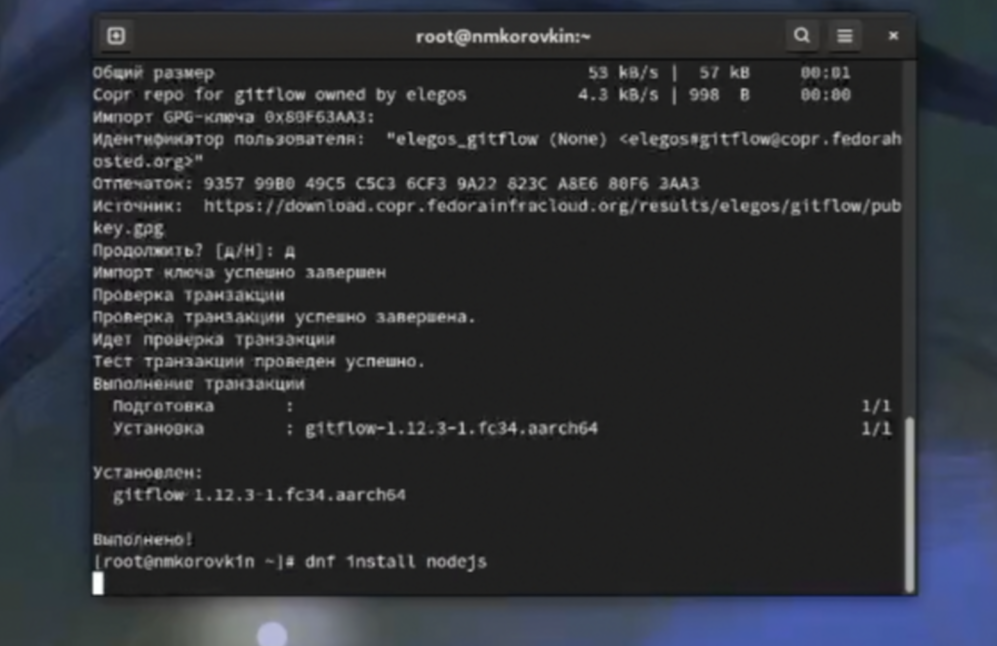{#fig:003}

Затем устанавливаем pnpm(рис. [-@fig:004]).

{#fig:004}

далее настраиваем  pnpm (рис. [-@fig:005]).

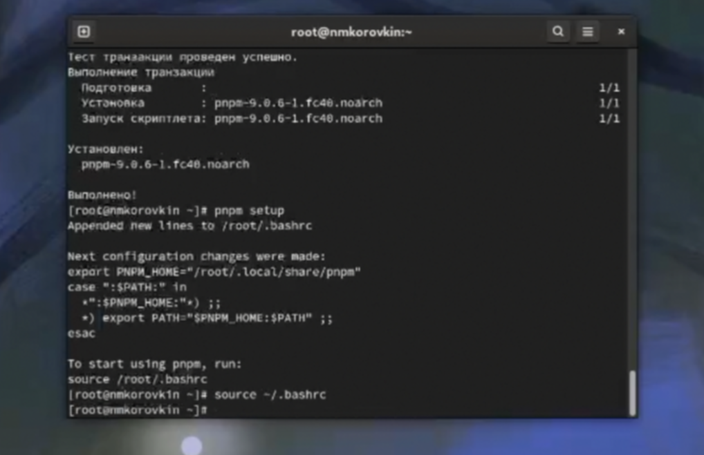{#fig:005}

И установим с помощью него Commitizen (рис. [-@fig:006]).

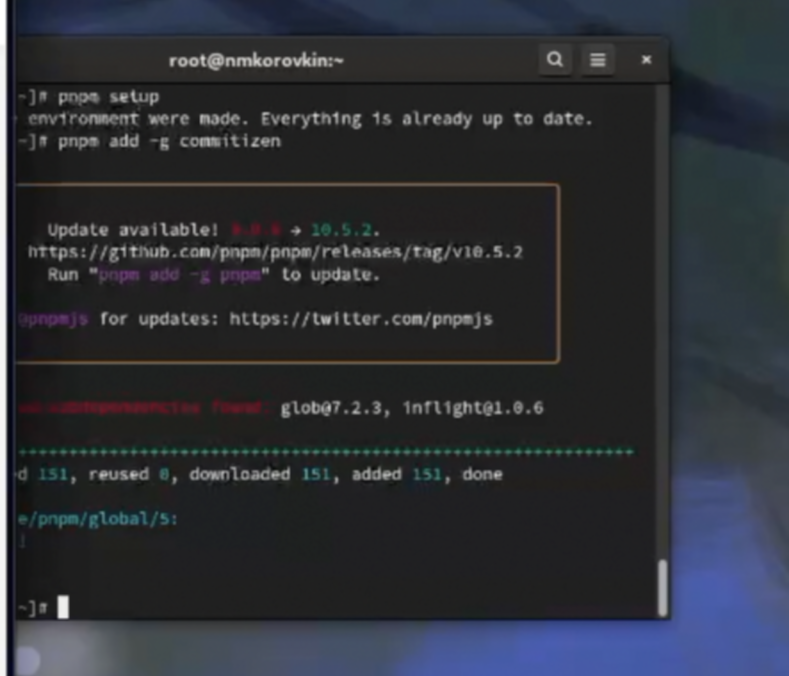{#fig:006}

Создадим тестовый репозиторий git-extended (рис. [-@fig:007]).

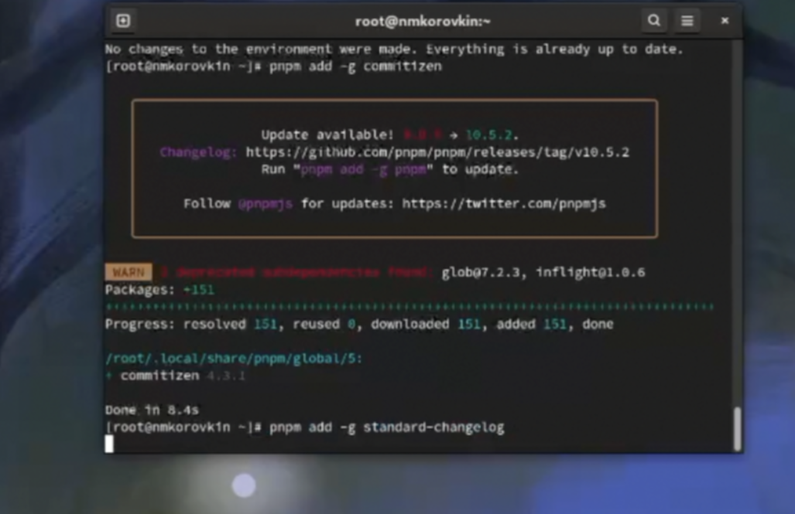{#fig:007}

И клонируем его себе на компьютер, а затем  сделаем соответствующий коммит.(рис. [-@fig:008]).

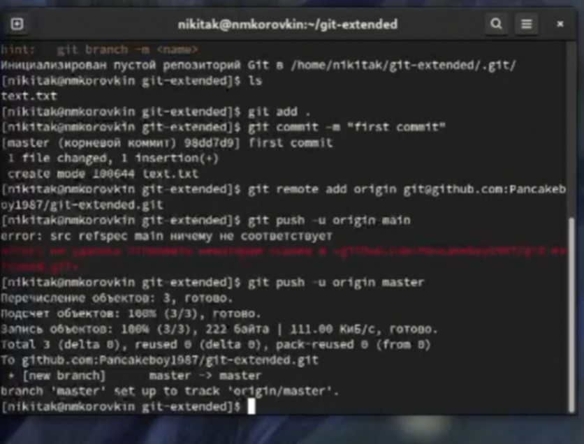{#fig:008}

Все изменения отправляем на GitHub.

Теперь проинициализируем pnpm.
После инициализации создастся файл package.json, который нужно изменить следующим образом (рис. [-@fig:009]).

{#fig:009}

Затем делаем коммит и отправляем все на сервер.(рис. [-@fig:010]).

{#fig:010}

Теперь проинициализируем gitflow. (рис. [-@fig:011]).

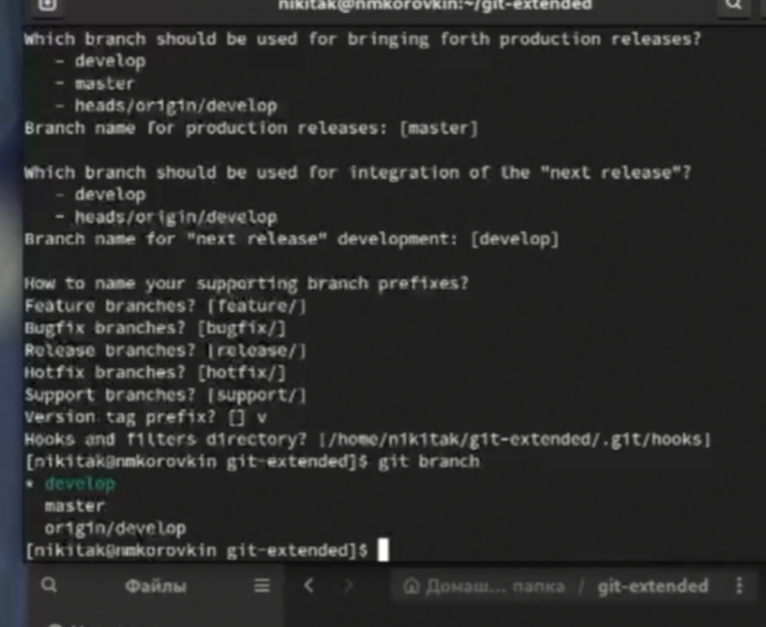{#fig:011}

Настроим ветки.(рис. [-@fig:012]).

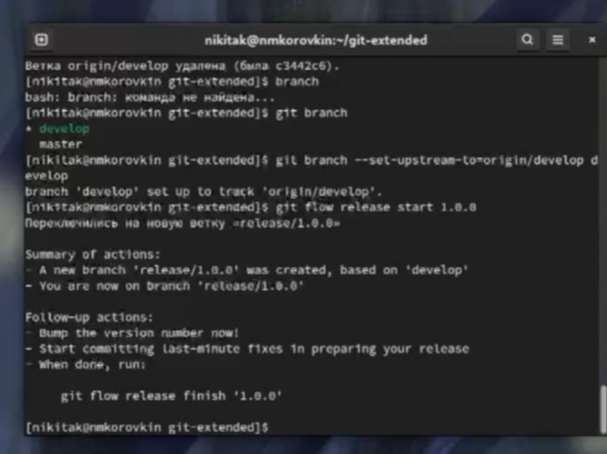{#fig:012}

Создаем changelog.(рис. [-@fig:013]).

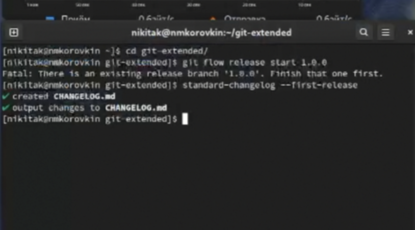{#fig:013}

Проиндексируем changelog и сделаем коммит (рис. [-@fig:014]).

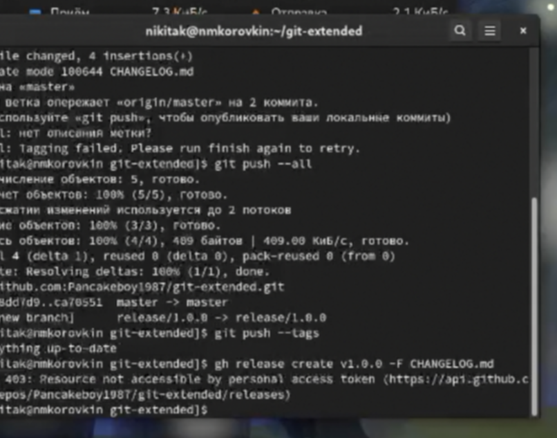{#fig:014}

Теперь сольём ветку release с веткой develop (рис. [-@fig:015]).

{#fig:015}

Делаем обновленный релиз и добавляем туда чейнджлог.(рис. [-@fig:016]).

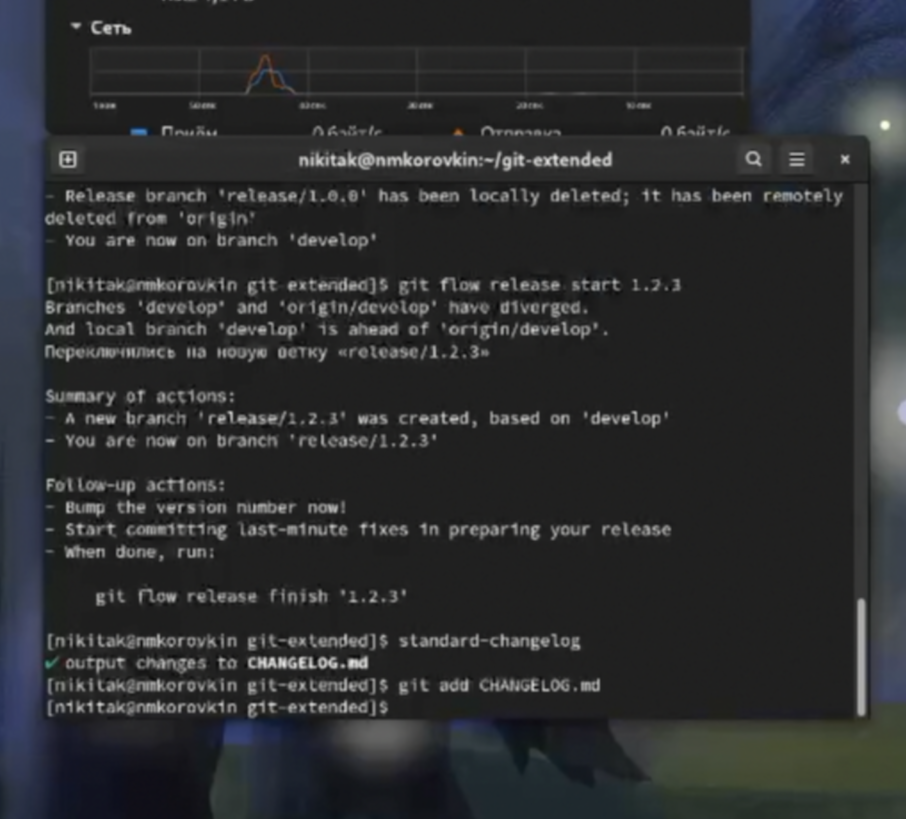{#fig:016}

Добавляем комментарий в коммит(рис. [-@fig:017]).

{#fig:017}

Сольем ветку с журналом изменений с основной веткой.(рис. [-@fig:018]).

{#fig:018}

Загрузим изменения в гитхаб и создадим релиз (рис. [-@fig:019]).

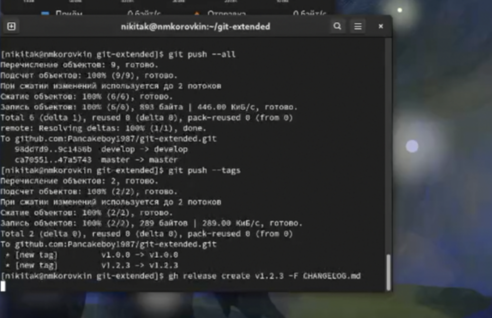{#fig:019}

# Выводы

В ходе выполнения лабораторной работы мною были получены навыки работы с расширенными возможностями git, кроме того были созданы релизы к репозиторию и дополнительные ветки, которые автор научился сливать воедино

# Список литературы{.unnumbered}

::: {#refs}
:::
