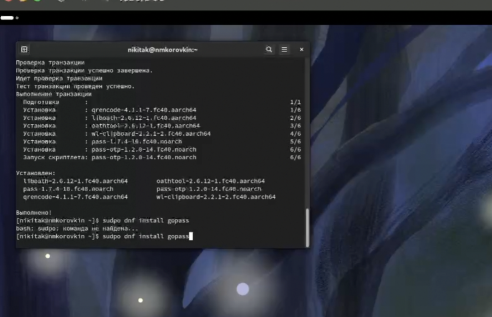
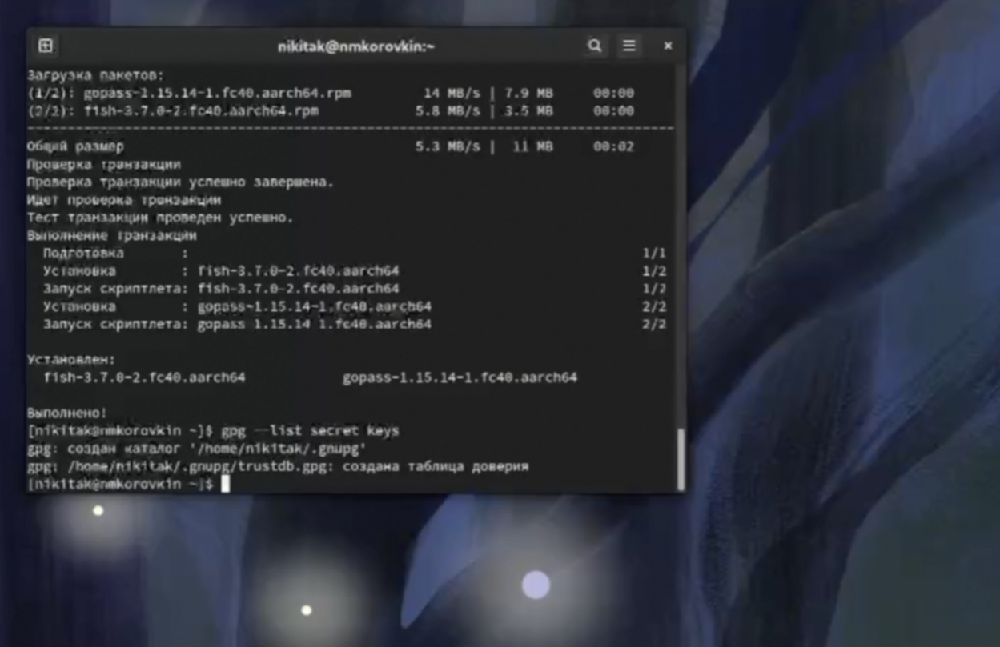
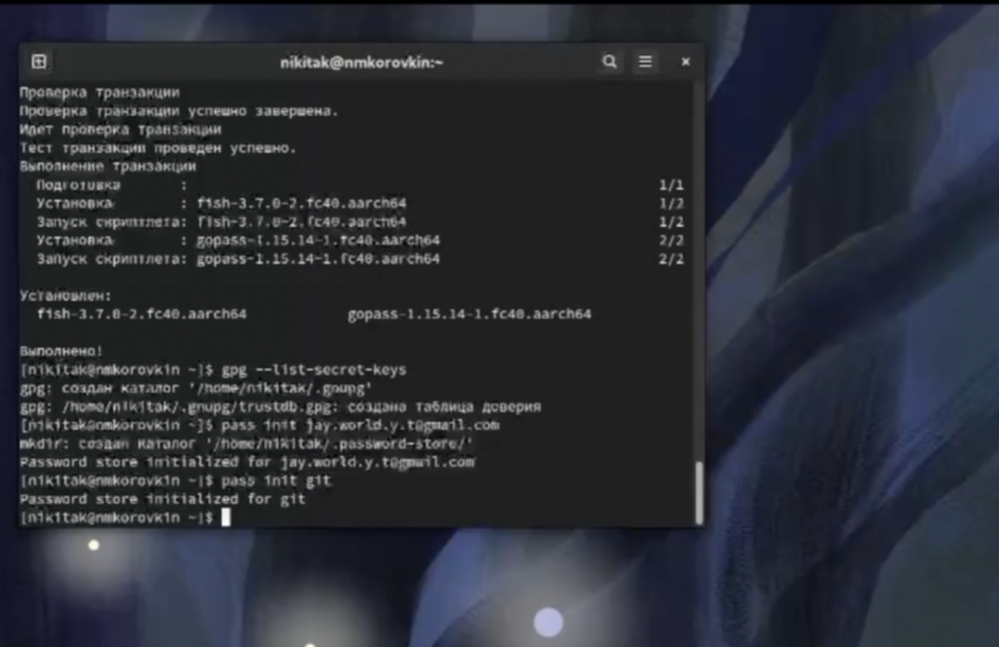
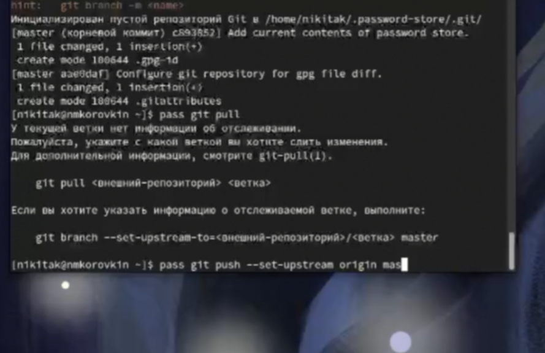
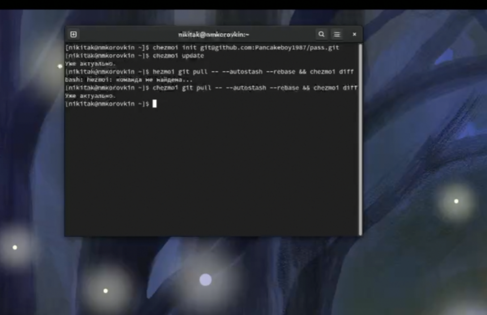
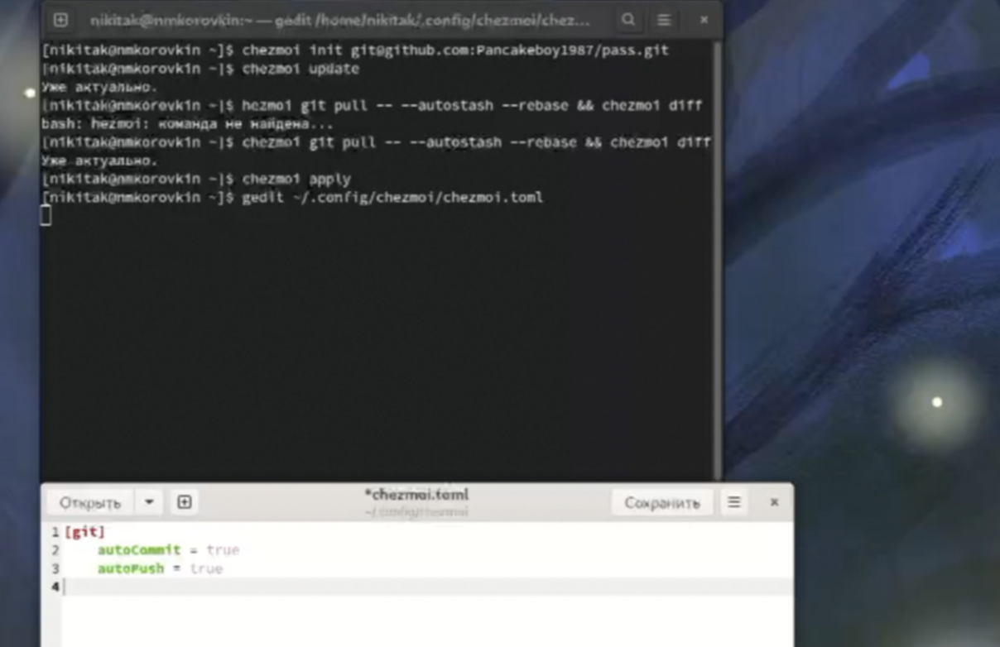

---
## Front matter
lang: ru-RU
title: Лабораторная работа №5
subtitle: Презентация
author:
  - Коровкин Н.М
institute:
  - Российский университет дружбы народов, Москва, Россия
date: 5 марта 2025

## i18n babel
babel-lang: russian
babel-otherlangs: english

## Formatting pdf
toc: false
toc-title: Содержание
slide_level: 2
aspectratio: 169
section-titles: true
theme: metropolis
header-includes:
 - \metroset{progressbar=frametitle,sectionpage=progressbar,numbering=fraction}
 - '\makeatletter'
 - '\beamer@ignorenonframefalse'
 - '\makeatother'
 
## Fonts
mainfont: PT Serif
romanfont: PT Serif
sansfont: PT Sans
monofont: PT Mono
mainfontoptions: Ligatures=TeX
romanfontoptions: Ligatures=TeX
sansfontoptions: Ligatures=TeX,Scale=MatchLowercase
monofontoptions: Scale=MatchLowercase,Scale=0.9
---

# Информация

## Докладчик

:::::::::::::: {.columns align=center}
::: {.column width="70%"}

  * Коровкин Никита Михайлович
  * Студент
  * Российский университет дружбы народов
  * [1132246835@pfur.ru](mailto:1132246835@pfur.ru)

:::
::: {.column width="30%"}

:::
::::::::::::::

## Цель

Научиться пользоваться pass и chezmoi

## Задание

Настроить ОС, синхронизируя её с данной. 
Научиться использовать программы для управления паролями 

## Выполнение лабораторной работы

Для начала установим  pass и pass-opt

## Установка

Уставновим gopass

## Установка

Выведем список pgp ключей 

## Установка

Проинициализируем pass, указав свой email и  Проинициализируем репозиторий в git для pass 

## Установка

Создадим репозиторий

Делаем коммит

## Настройка

НАстраиваем ветку на мейн

## Настройка

Инициализируем и настраиваем chezmoi

## Настройка

Открываем файл

## Настройка

вписываем туда необходимые настройки[

## Выводы

В результате выполнения лабораторной работы были настроены программы для управления паролями, а также появился навык синхронизации настроек ОС

