---
## Front matter
lang: ru-RU
title: Лабораторная работа №6
subtitle: Презентация
author:
  - Коровкин Н.М
institute:
  - Российский университет дружбы народов, Москва, Россия
date: 5 марта 2025

## i18n babel
babel-lang: russian
babel-otherlangs: english

## Formatting pdf
toc: false
toc-title: Содержание
slide_level: 2
aspectratio: 169
section-titles: true
theme: metropolis
header-includes:
 - \metroset{progressbar=frametitle,sectionpage=progressbar,numbering=fraction}
 - '\makeatletter'
 - '\beamer@ignorenonframefalse'
 - '\makeatother'
 
## Fonts
mainfont: PT Serif
romanfont: PT Serif
sansfont: PT Sans
monofont: PT Mono
mainfontoptions: Ligatures=TeX
romanfontoptions: Ligatures=TeX
sansfontoptions: Ligatures=TeX,Scale=MatchLowercase
monofontoptions: Scale=MatchLowercase,Scale=0.9
---

# Информация

## Докладчик

:::::::::::::: {.columns align=center}
::: {.column width="70%"}

  * Коровкин Никита Михайлович
  * Студент
  * Российский университет дружбы народов
  * [1132246835@pfur.ru](mailto:1132246835@pfur.ru)

:::
::: {.column width="30%"}

:::
::::::::::::::

## Цель

Приобретение практических навыков взаимодействия пользователя с системой посредством командной строки 

## Задание

1. Определите полное имя вашего домашнего каталога. Далее относительно этого каталога будут выполняться последующие упражнения.  
2. Выполните следующие действия:  
2.1. Перейдите в каталог /tmp.  
2.2. Выведите на экран содержимое каталога /tmp. Для этого используйте команду ls с различными опциями. Поясните разницу в выводимой на экран информации.  
2.3. Определите, есть ли в каталоге /var/spool подкаталог с именем cron?  
2.4. Перейдите в Ваш домашний каталог и выведите на экран его содержимое. Определите, кто является владельцем файлов и подкаталогов?  
3. Выполните следующие действия:  
3.1. В домашнем каталоге создайте новый каталог с именем newdir. 
3.2. В каталоге ~/newdir создайте новый каталог с именем morefun. 
3.3. В домашнем каталоге создайте одной командой три новых каталога с именами letters, memos, misk. Затем удалите эти каталоги одной командой. 
3.4. Попробуйте удалить ранее созданный каталог ~/newdir командой rm. Проверьте, был ли каталог удалён. 
3.5. Удалите каталог ~/newdir/morefun из домашнего каталога. Проверьте, был ликаталог удалён. 
4. С помощью команды man определите, какую опцию команды ls нужно использовать для просмотра содержимое не только указанного каталога, но и подкаталогов, входящих в него. 
5. С помощью команды man определите набор опций команды ls, позволяющий отсортировать по времени последнего изменения выводимый список содержимого каталога с развёрнутым описанием файлов. 
6. Используйте команду man для просмотра описания следующих команд: cd, pwd, mkdir, rmdir, rm. Поясните основные опции этих команд. 
7. Используя информацию, полученную при помощи команды history, выполните модификацию и исполнение нескольких команд из буфера команд. 

## Выполнение лабораторной работы

Сперва посмотрим полный путь для нашего каталога 

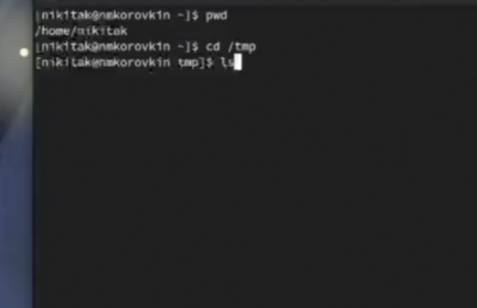

## Выполнение лабораторной работы

Далее, перейдём в каталог /tmp и просмотрим его содержимое 

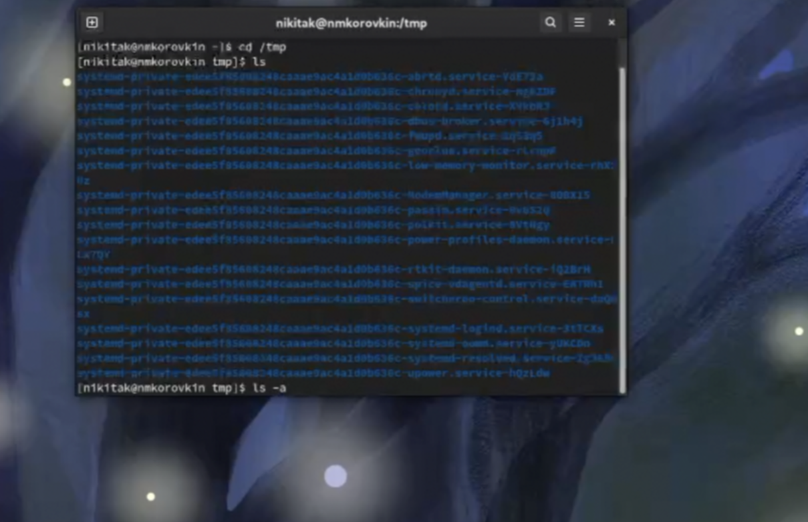

## Выполнение лабораторной работы

Напишем ls и добавим ключ -a, таким образом -  выведем и дополнительные файлы

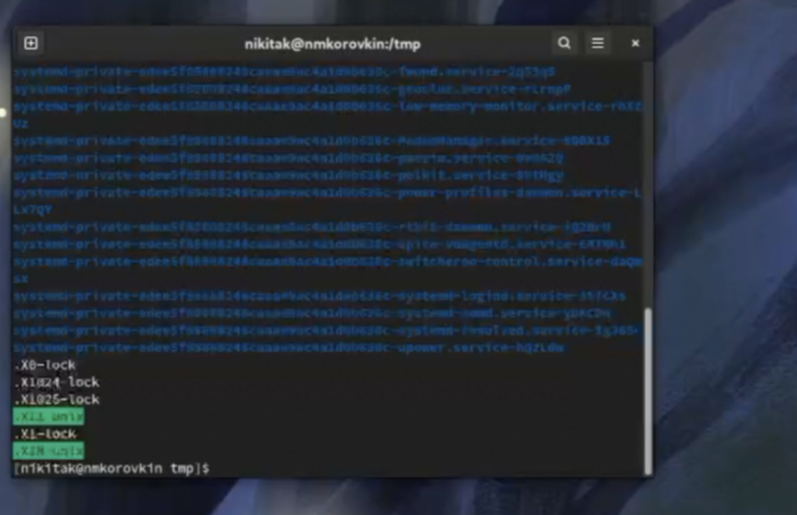

## Выполнение лабораторной работы

Теперь выведем файлы с полной информацией с помощью ключа ls  -l 

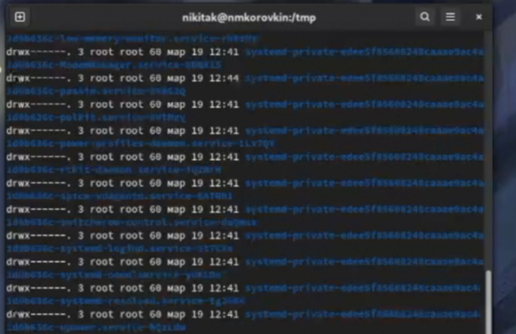

## Выполнение лабораторной работы

Теперь выведем типы элементов с помощью -F 

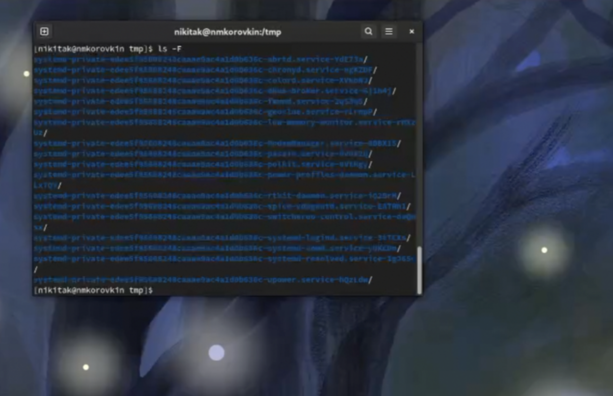

## Выполнение лабораторной работы

Используем все 3 ключа сразу 
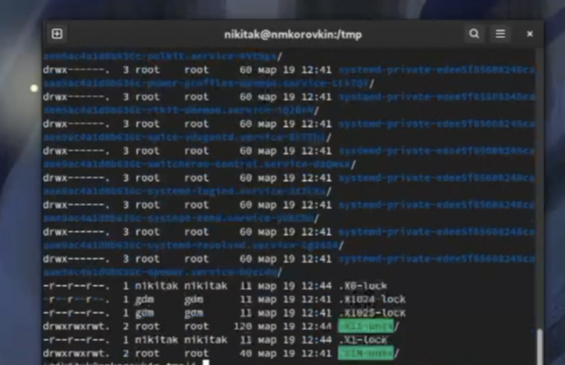

Посмотрим, есть ли в каталоге /var/spool каталог cron. Как видим, он есть 

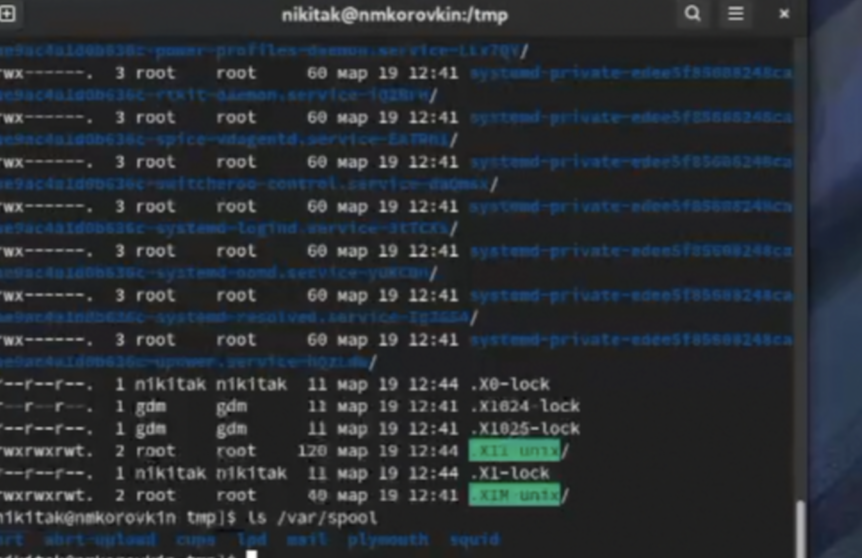

Перейдём в домашнюю директорию и выведем подробный список файлов и посмотрим, кому они принадлежат. Как мы видим, они принадлежат моему пользователю 

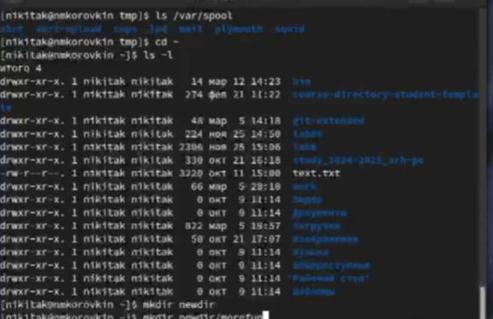

## Выполнение лабораторной работы

Создадим каталог newdir. Внутри него еще один каталог, подкаталог -  и удалим все 

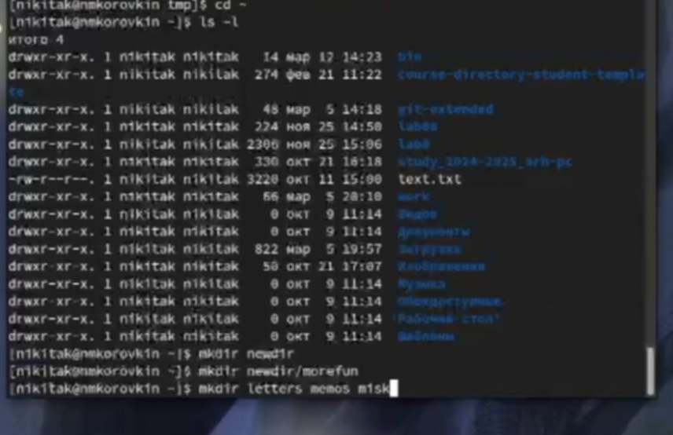

## Выполнение лабораторной работы

Посмотрим с помощью man, какой ключ для вывода всех подкаталогов. Это ключ -R 
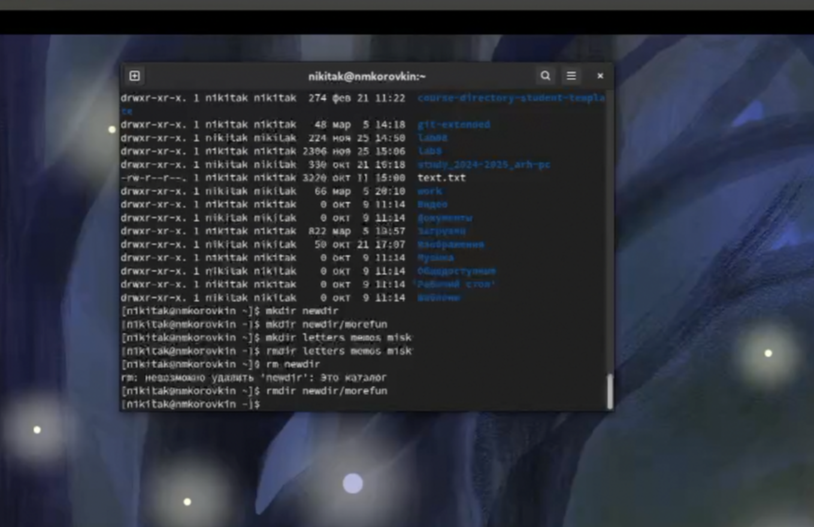

## Выполнение лабораторной работы

Посмотрим теперь ключ для вывода элементов по времени 

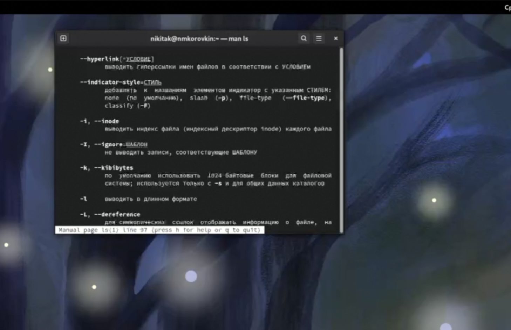

## Выполнение лабораторной работы

Посмотрим все существующие ключи для cd. 
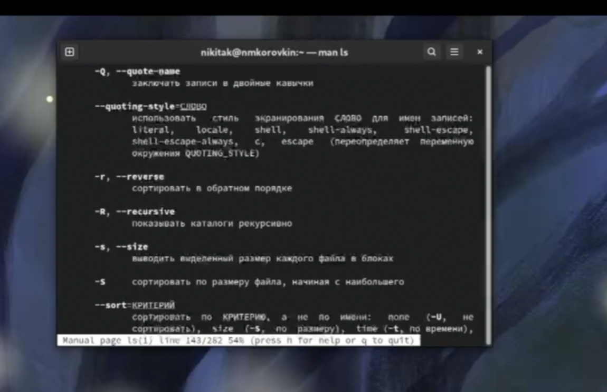

## Выполнение лабораторной работы

Посмотрим ключи для mkdir. Основные - m (Поставить права доступа), p (Создать родительские каталоги) 

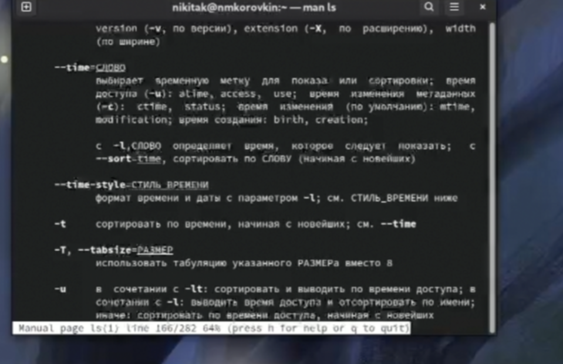

## Выполнение лабораторной работы

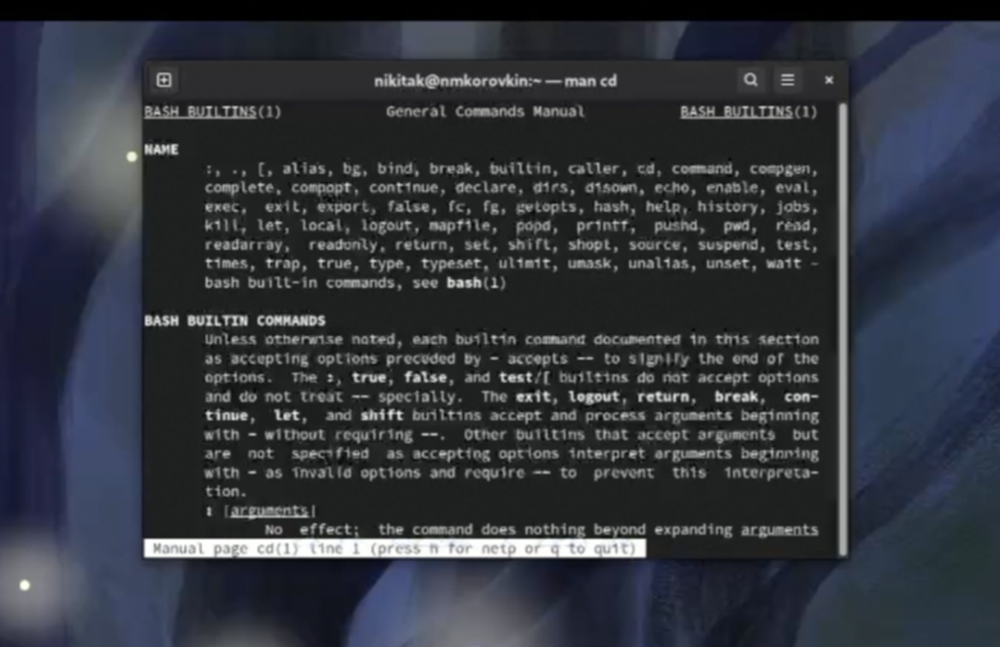

## Выполнение лабораторной работы

Посмотрим ключи для rmdir. Основные -  p (Удалить родительские каталоги), v (Подробно выводить каждое действие) 

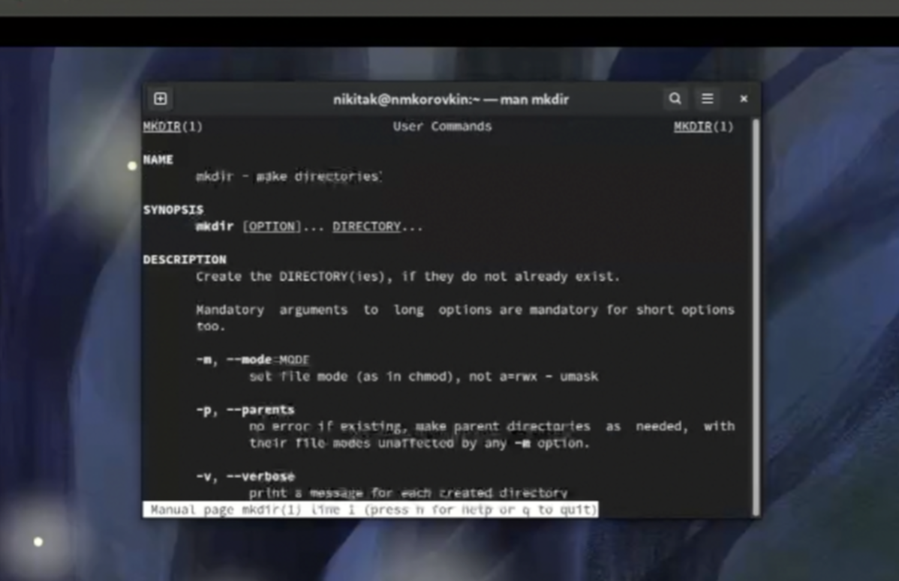

## Выполнение лабораторной работы

Посмотрим ключи для rm. Основные -  f (принудительно удалять), i (спрашивать подтверждение)

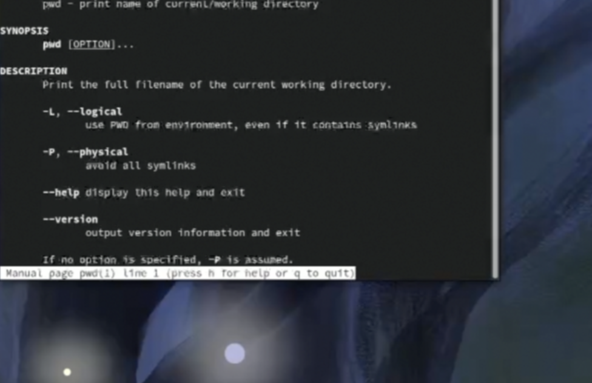

Выведем историю команд  с помощью history 

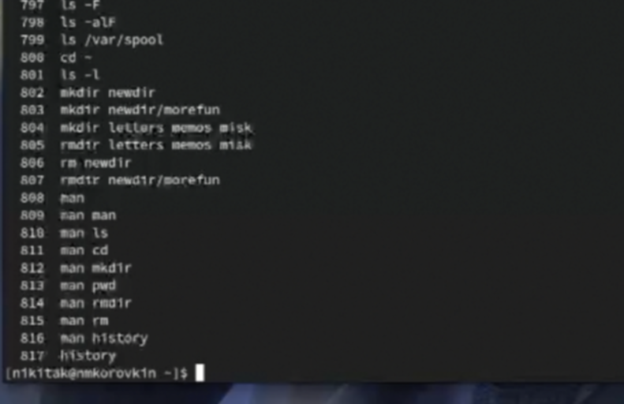

## Выводы

В результате выполнения лабораторной работы были настроены программы для управления паролями, а также появился навык синхронизации настроек ОС

