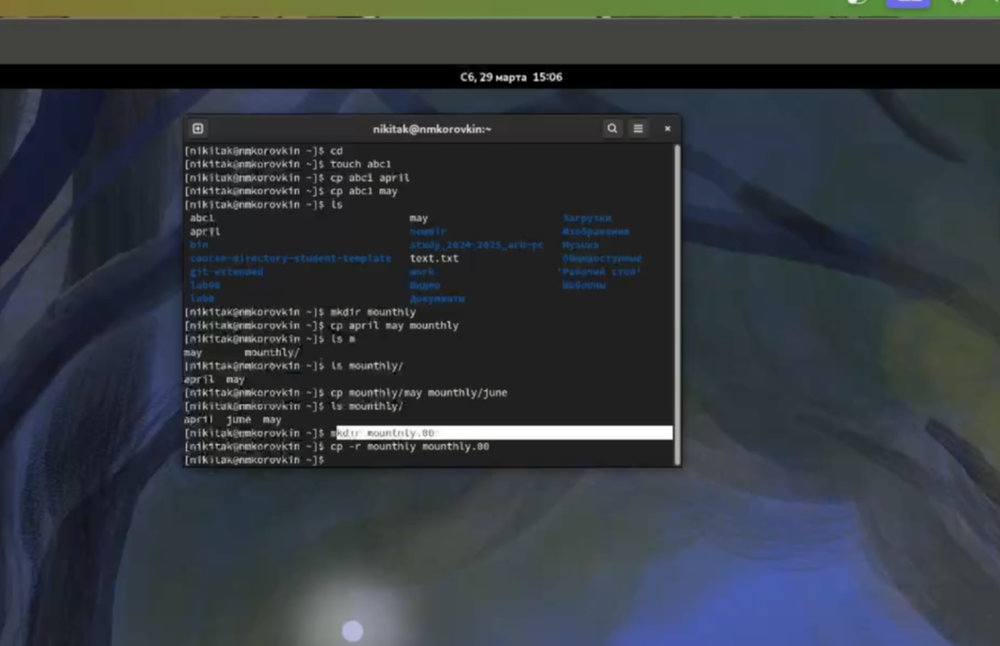
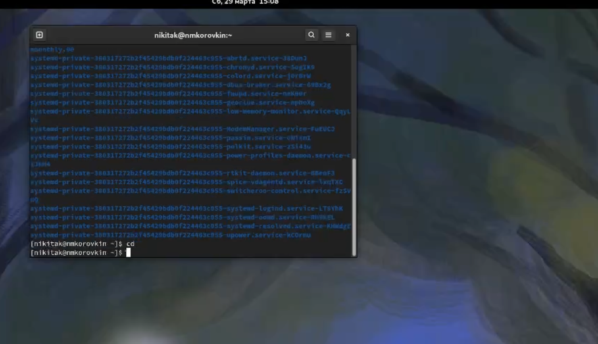
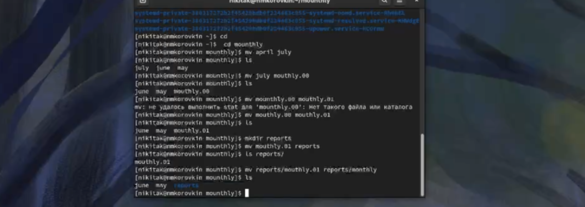
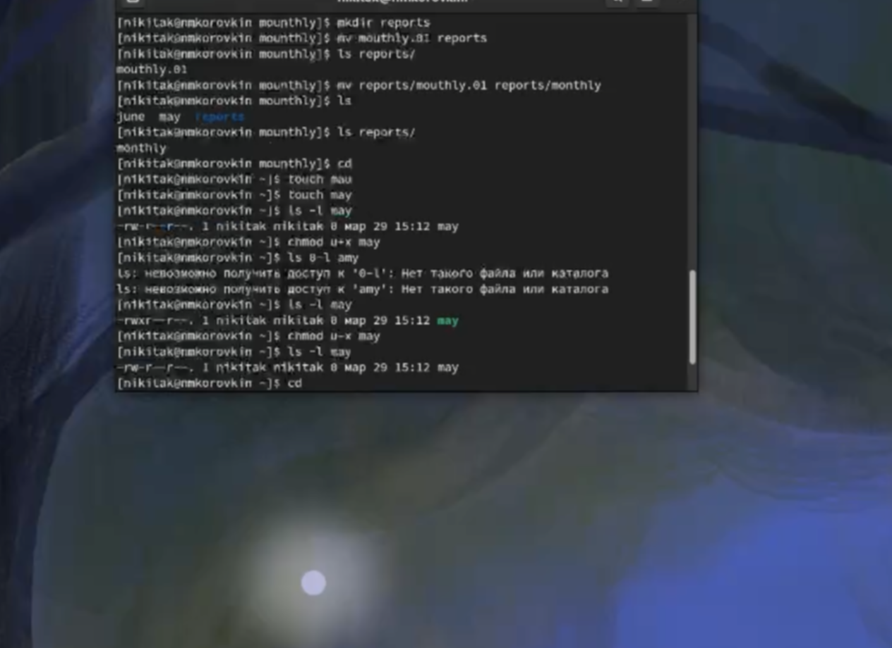
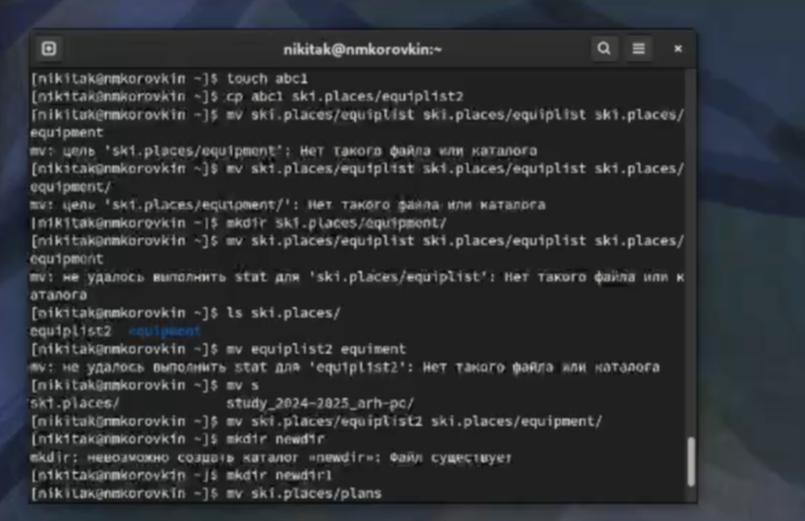
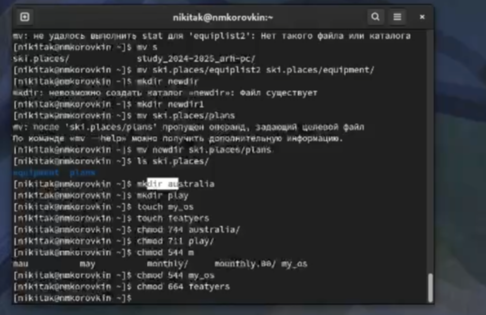
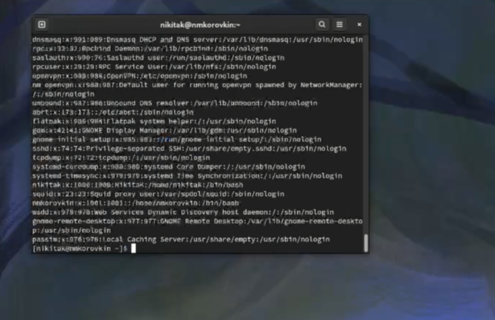
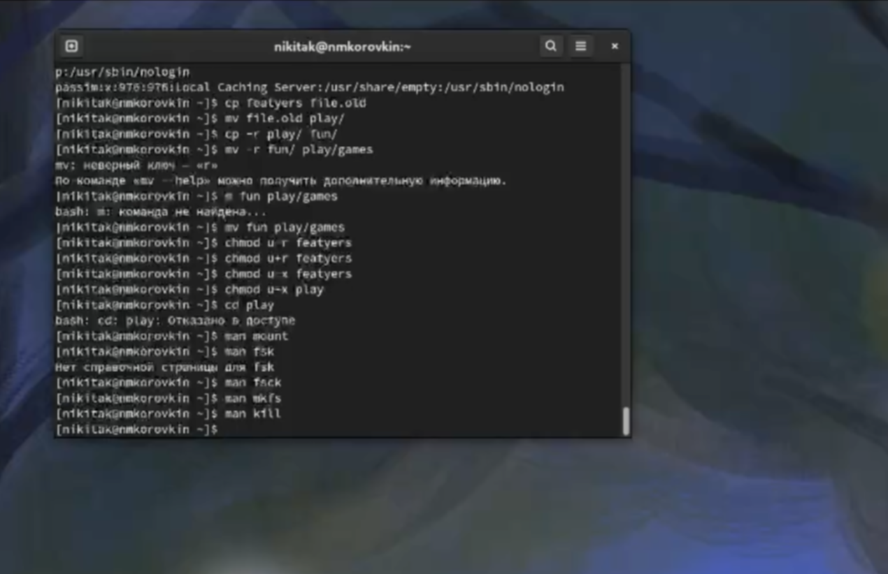

---
## Front matter
lang: ru-RU
title: Лабораторная работа №7
subtitle: Презентация
author:
  - Коровкин Н.М
institute:
  - Российский университет дружбы народов, Москва, Россия
date: 5 марта 2025

## i18n babel
babel-lang: russian
babel-otherlangs: english

## Formatting pdf
toc: false
toc-title: Содержание
slide_level: 2
aspectratio: 169
section-titles: true
theme: metropolis
header-includes:
 - \metroset{progressbar=frametitle,sectionpage=progressbar,numbering=fraction}
 - '\makeatletter'
 - '\beamer@ignorenonframefalse'
 - '\makeatother'
 
## Fonts
mainfont: PT Serif
romanfont: PT Serif
sansfont: PT Sans
monofont: PT Mono
mainfontoptions: Ligatures=TeX
romanfontoptions: Ligatures=TeX
sansfontoptions: Ligatures=TeX,Scale=MatchLowercase
monofontoptions: Scale=MatchLowercase,Scale=0.9
---

# Информация

## Докладчик

:::::::::::::: {.columns align=center}
::: {.column width="70%"}

  * Коровкин Никита Михайлович
  * Студент
  * Российский университет дружбы народов
  * [1132246835@pfur.ru](mailto:1132246835@pfur.ru)

:::
::: {.column width="30%"}

:::
::::::::::::::

## Выполнение лабораторной работы

Выполним первый раздел. Научимся копировать файлы с помощью команды cp. Создадим несколько файлов и поработаем с ними 

Теперь попробуем скопировать файлы в каталог /tmp 

## Выполнение лабораторной работы

Перейдем ко второму этапу и воспользуемся командой  mv

## Выполнение лабораторной работы

Разберёмся с правами доступа. Изменение прав осуществляется с помощью сhmod. Мы можем как давать права, так и отнимать 

## Выполнение лабораторной работы

Приступим к следующему этапу

## Выполнение лабораторной работы

Создаем несколько каталогов и перемещаем один в другой,лишая и наделяя их правами

## Выполнение лабораторной работы

Проверим /tmp/passwd 

## Выполнение лабораторной работы

Создаем каталоги и файлы, неаделяем их правами а затем смотрим,значения
тех или иных команд

## Выполнение лабораторной работы

mount - для монтирования файловых систем  
fsck - проверка файловой системы  
mkfs - создание файловой системы Linux  
kill - убить процесс  

## Контрольные вопросы

1. btrfs - Корневая файловая система, относительно новая, в ней добавили много возможностей. Однако пока не является стандартом, так как всё ещё может быть нестабильной  
ext4 - Файловая система Linux, самая распространённая
2. Файловая система Linux имеет иерархическую структуру, начиная с корневой директории (/).  
Характеристика каждой директории первого уровня:  
/bin: В этой директории содержатся исполняемые файлы (бинарники), которые необходимы для базового функционирования системы в однопользовательском режиме.   
/boot: В этой директории хранятся файлы, необходимые для загрузки операционной системы. Это включает в себя ядро Linux (vmlinuz), файлы инициализации загрузчика и другие необходимые компоненты.  
/dev: Здесь содержатся файлы, представляющие устройства в системе.   
/etc: Эта директория содержит конфигурационные файлы для различных программ и служб, устанавливаемые в системе.  
/home: Здесь располагаются домашние каталоги пользователей. Каждый пользователь имеет свою собственную поддиректорию в этой директории для хранения своих файлов и настроек.  
/lib: В этой директории хранятся разделяемые библиотеки, которые используются программами во время выполнения.  
/media: Эта директория предназначена для временного монтирования съемных носителей, таких как USB-флешки, CD-ROMы и другие.  
/mnt: Здесь монтируются временные файловые системы. Обычно используется для временного монтирования файловых систем извне основной файловой системы, например, сетевых ресурсов.  
/opt: В этой директории устанавливаются дополнительные программы, не входящие в стандартную поставку дистрибутива.  
/proc: Эта директория представляет виртуальную файловую систему, содержащую информацию о запущенных процессах, настройках ядра и другие системные параметры.  
3. mount  
4. Отсутствие синхронизации, аварийное завершение работы. Исправляется с помощью утилит для проверки дисков 
5. mkfs  
6. cat - выводит всё  
tail - выводит последние 10 строк  
head - выводит первые 10 строк  
7. Копирование, копирование с новым именем, копирование каталогов  
8. Перемещение, перемещение с новым именем, перемещение каталогов  
9. Право читать, записывать и запускать файл. Меняются с помощью chmod  

## Выводы

В результате выполнения лобораторной работы были получены навыки работы с файлами и каталогами, а также было получено понимание работы с правами доступа
