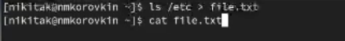
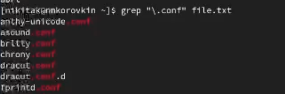
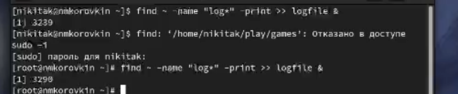
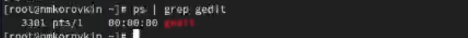
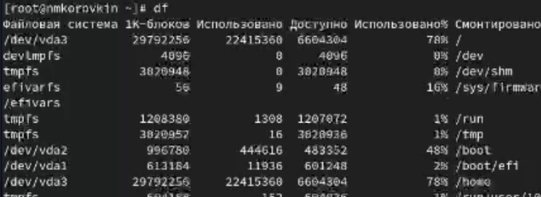
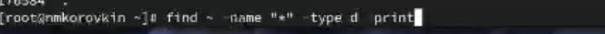

---
## Front matter
lang: ru-RU
title: Лабораторная работа №8
subtitle: Презентация
author:
  - Коровкин Н.М
institute:
  - Российский университет дружбы народов, Москва, Россия
date: 5 марта 2025

## i18n babel
babel-lang: russian
babel-otherlangs: english

## Formatting pdf
toc: false
toc-title: Содержание
slide_level: 2
aspectratio: 169
section-titles: true
theme: metropolis
header-includes:
 - \metroset{progressbar=frametitle,sectionpage=progressbar,numbering=fraction}
 - '\makeatletter'
 - '\beamer@ignorenonframefalse'
 - '\makeatother'
 
## Fonts
mainfont: PT Serif
romanfont: PT Serif
sansfont: PT Sans
monofont: PT Mono
mainfontoptions: Ligatures=TeX
romanfontoptions: Ligatures=TeX
sansfontoptions: Ligatures=TeX,Scale=MatchLowercase
monofontoptions: Scale=MatchLowercase,Scale=0.9
---

# Информация

## Докладчик

:::::::::::::: {.columns align=center}
::: {.column width="70%"}

  * Коровкин Никита Михайлович
  * Студент
  * Российский университет дружбы народов
  * [1132246835@pfur.ru](mailto:1132246835@pfur.ru)

:::
::: {.column width="30%"}

:::
::::::::::::::

## Выполнение лабораторной работы

Для начала перенаправим вывод команды ls в файл c помощью >

Теперь дозапишем в наш файл содержимое нашего домашнего каталога с помощью >> 

## Выполнение лабораторной работы

Затем при помощи grep выведем содержимое нашего файла, куда мы записывали содержимое каталогов, таким образом, чтобы выводились только файлы с расширением conf 

## Выполнение лабораторной работы

Найдём в домашнем каталоге файлы, которые начинаются на "c" с помощью команды find 

## Выполнение лабораторной работы

Теперь выведем постранично файлы, которые начинаются на "h", с помощью того же find. Для этого создадим конвеер, и передадим вывод в команду less

## Выполнение лабораторной работы

Теперь запишем в файл имена файлов, начинающиеся с "log", но в фоновом режиме с помощью &

## Выполнение лабораторной работы

Удалим этот файл 

## Выполнение лабораторной работы

Убьём процесс gedit по его pid 

## Выполнение лабораторной работы

Посмотрим на размер доступного места в системе с помощью df 
Выведем все директории в домашнем каталоге с помощью find, указав в аргументе -type букву "d" (directory) 

{

## Выводы

В результате выполнения лабораторной работы были получены навыки работы с конвеером и перенаправлением потока вывода

