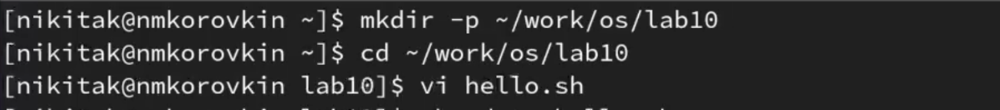
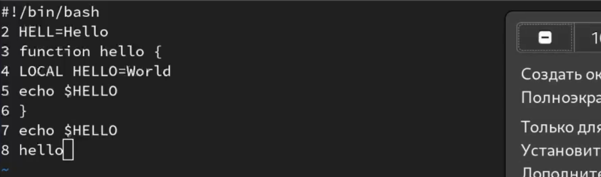
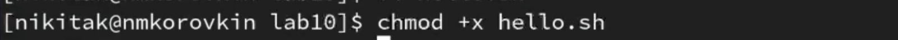
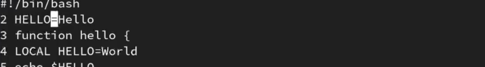
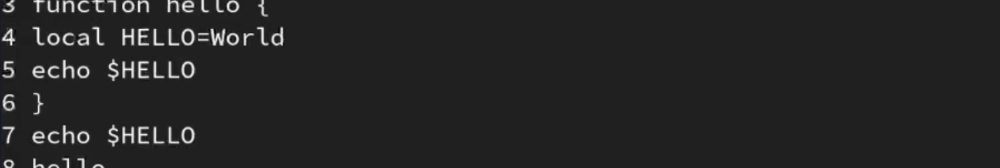
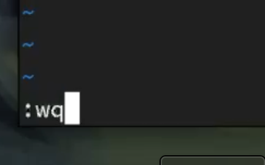

---
## Front matter
lang: ru-RU
title: Лабораторная работа №10
subtitle: Презентация
author:
  - Коровкин Н.М
institute:
  - Российский университет дружбы народов, Москва, Россия
date: 16 апреля 2025

## i18n babel
babel-lang: russian
babel-otherlangs: english

## Formatting pdf
toc: false
toc-title: Содержание
slide_level: 2
aspectratio: 169
section-titles: true
theme: metropolis
header-includes:
 - \metroset{progressbar=frametitle,sectionpage=progressbar,numbering=fraction}
 - '\makeatletter'
 - '\beamer@ignorenonframefalse'
 - '\makeatother'
 
## Fonts
mainfont: PT Serif
romanfont: PT Serif
sansfont: PT Sans
monofont: PT Mono
mainfontoptions: Ligatures=TeX
romanfontoptions: Ligatures=TeX
sansfontoptions: Ligatures=TeX,Scale=MatchLowercase
monofontoptions: Scale=MatchLowercase,Scale=0.9
---

# Информация

## Докладчик

:::::::::::::: {.columns align=center}
::: {.column width="70%"}

  * Коровкин Никита Михайлович
  * Студент
  * Российский университет дружбы народов
  * [1132246835@pfur.ru](mailto:1132246835@pfur.ru)

:::
::: {.column width="30%"}

:::
::::::::::::::

## Цель работы

Познакомиться с операционной системой Linux. Получить практические навыки работы с редактором vi, установленным по умолчанию практически во всех дистрибутивах

## Выполнение лабораторной работы

Для начала создадим каталог lab10, в котором с помощью vi создадим скриптовый файл hello.sh 

## Выполнение лабораторной работы

Файл сразу же откроется в vi. Перейдём с помощью клавиши i в режим вставки и вставим следующий текст. Затем, нажмём ":" и напишем wq для сохранения файла и выхода 

## Выполнение лабораторной работы

Сделаем файл исполняемым 

## Выполнение лабораторной работы
С помощью стрелочек перейдём на конец слова HELLO и перейдём в режим вставки. Допишем букву "O" 

## Выполнение лабораторной работы

Теперь перейдём на строку, где заменим LOCAL на local 

## Выполнение лабораторной работы

Добавим строчку и сотрем ее, с помощью  u вернем действие.

 Теперь сохраним с помощью :wq наш файл .

## Выводы

В результате выполнения лабораторной работы появились навыки работы с vi

