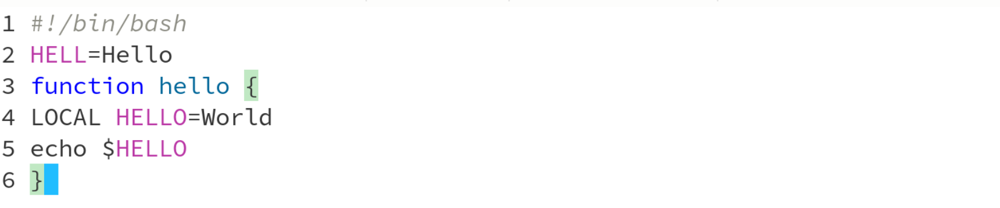
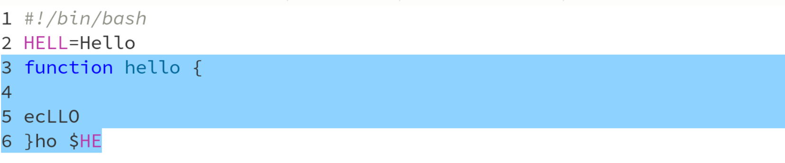
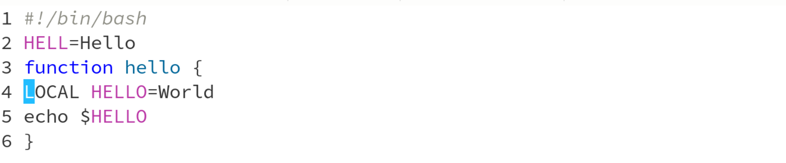

---
## Front matter
lang: ru-RU
title: Лабораторная работа №11
subtitle: Презентация
author:
  - Коровкин Н.М
institute:
  - Российский университет дружбы народов, Москва, Россия
date: 16 апреля 2025

## i18n babel
babel-lang: russian
babel-otherlangs: english

## Formatting pdf
toc: false
toc-title: Содержание
slide_level: 2
aspectratio: 169
section-titles: true
theme: metropolis
header-includes:
 - \metroset{progressbar=frametitle,sectionpage=progressbar,numbering=fraction}
 - '\makeatletter'
 - '\beamer@ignorenonframefalse'
 - '\makeatother'
 
## Fonts
mainfont: PT Serif
romanfont: PT Serif
sansfont: PT Sans
monofont: PT Mono
mainfontoptions: Ligatures=TeX
romanfontoptions: Ligatures=TeX
sansfontoptions: Ligatures=TeX,Scale=MatchLowercase
monofontoptions: Scale=MatchLowercase,Scale=0.9
---

# Информация

## Докладчик

:::::::::::::: {.columns align=center}
::: {.column width="70%"}

  * Коровкин Никита Михайлович
  * Студент
  * Российский университет дружбы народов
  * [1132246835@pfur.ru](mailto:1132246835@pfur.ru)

:::
::: {.column width="30%"}

:::
::::::::::::::

## Цель работы

Познакомиться с операционной системой Linux. Получить практические навыки работы с редактором Emacs 

## Задание

Ознакомиться с теоретическим материалом. Ознакомиться с редактором emacs. Выполнить упражнения. Ответить на контрольные вопросы.

## Выполнение лабораторной работы

Откроем Emacs и создадим при помощии него новый файл

## Выполнение лабораторной работы

Вставим туда код из предложенного файла.

## Выполнение лабораторной работы

При помощи комбинации клавиш C-space выделяем всю область.

## Выполнение лабораторной работы

Перемещаем курсор с помощью других комбинаций.
затем скопируем, вырежем и вставим часть текст.

## Выполнение лабораторной работы

Уберем изменения

## Выполнение лабораторной работы

Откроем список буферов

## Выполнение лабораторной работы

Воспользуемся поиском

## Выводы

В результате выполнения лабораторной работы нами были получены навыки работы с текстовым редактором emacs.

