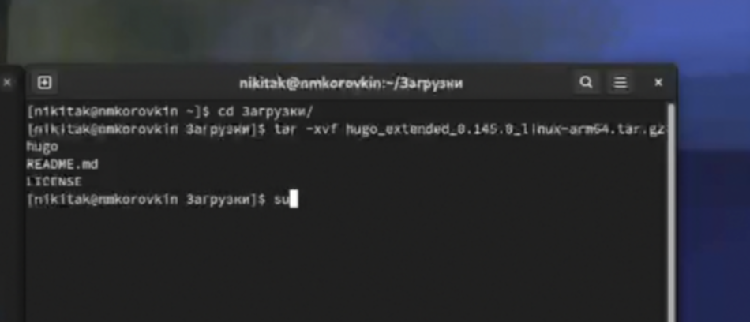
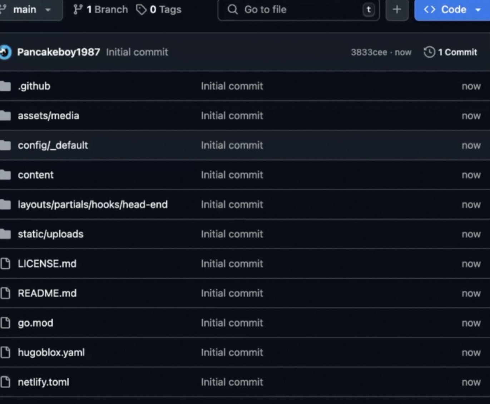
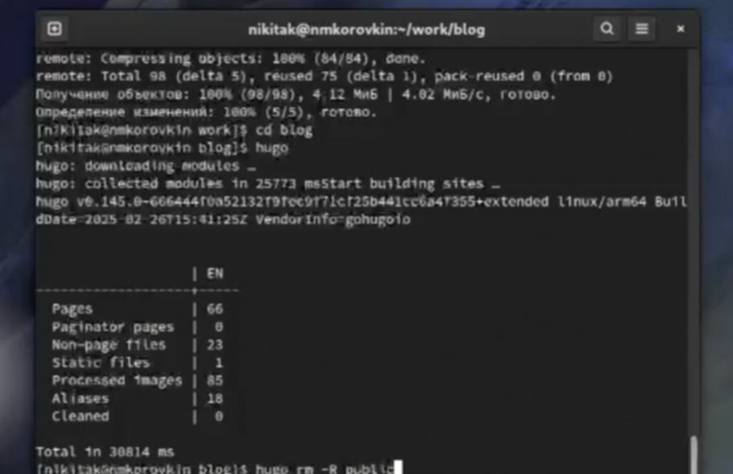
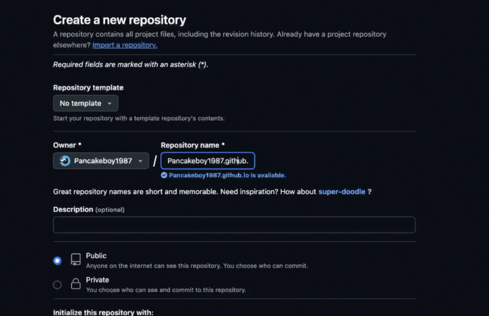
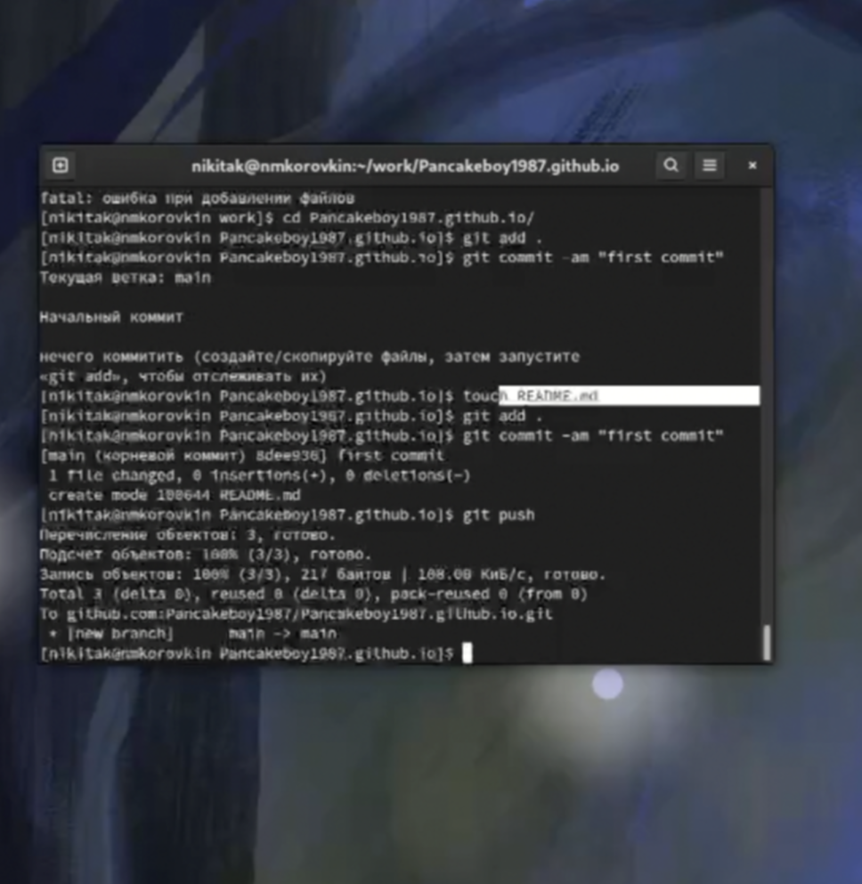
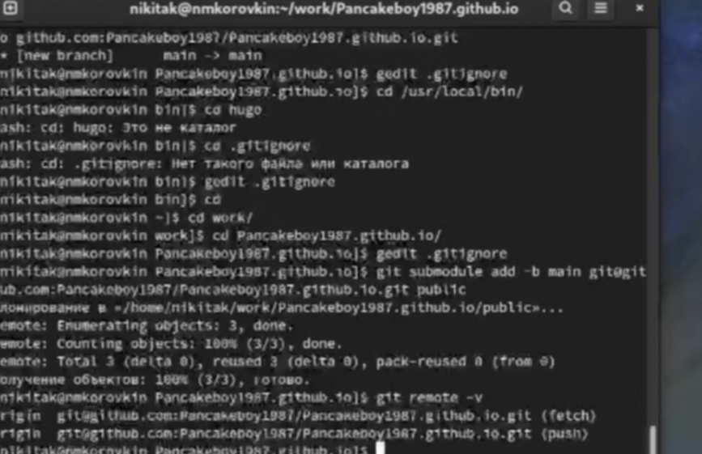
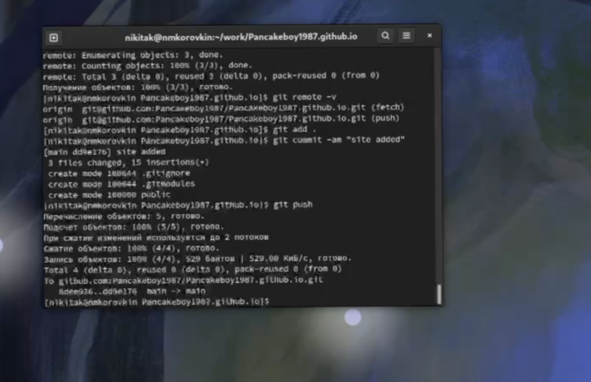

---
## Front matter
lang: ru-RU
title: Индивидуальный проект этап 1
subtitle: Презентация
author:
  - Коровкин Н.М
institute:
  - Российский университет дружбы народов, Москва, Россия
date: 5 марта 2025

## i18n babel
babel-lang: russian
babel-otherlangs: english

## Formatting pdf
toc: false
toc-title: Содержание
slide_level: 2
aspectratio: 169
section-titles: true
theme: metropolis
header-includes:
 - \metroset{progressbar=frametitle,sectionpage=progressbar,numbering=fraction}
 - '\makeatletter'
 - '\beamer@ignorenonframefalse'
 - '\makeatother'
 
## Fonts
mainfont: PT Serif
romanfont: PT Serif
sansfont: PT Sans
monofont: PT Mono
mainfontoptions: Ligatures=TeX
romanfontoptions: Ligatures=TeX
sansfontoptions: Ligatures=TeX,Scale=MatchLowercase
monofontoptions: Scale=MatchLowercase,Scale=0.9
---

# Информация

## Докладчик

:::::::::::::: {.columns align=center}
::: {.column width="70%"}

  * Коровкин Никита Михайлович
  * Студент
  * Российский университет дружбы народов
  * [1132246835@pfur.ru](mailto:1132246835@pfur.ru)

:::
::: {.column width="30%"}

:::
::::::::::::::

## Цель

Научиться создавать сайты с помощью Hugo и размещать их на хостинге github 

## Задачи

Установить необходимое программное обеспечение. 
Скачать шаблон темы сайта. 
Разместить его на хостинге git. 
Установить параметр для URLs сайта. 
Разместить заготовку сайта на Github pages.

## Установка

Для начала установим  hugo

## Распаковка файла

Затем перенесем распакованные файлы

## Создание репозитория

Далее создаем репозиторий по шаблону

## Клонирование репозитория

Клонируем репозиторий

## Натройка

Настраиваем Hugо

## Создание репозитория

Создаем еще один репозиторий для сайта

## Клонирование

Клонируем репозиторий

## Сливание воедино

Сливаем все воедино

## Создание коммита

Делаем коммит

# Выводы

В результате выполнения лабораторной работы был создан сайт, который находится на хостинге Github

