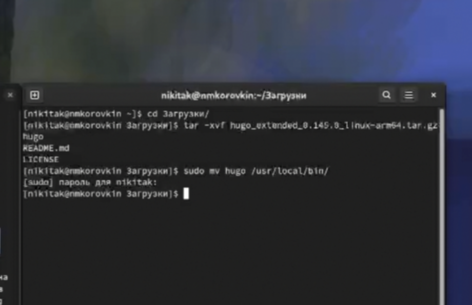
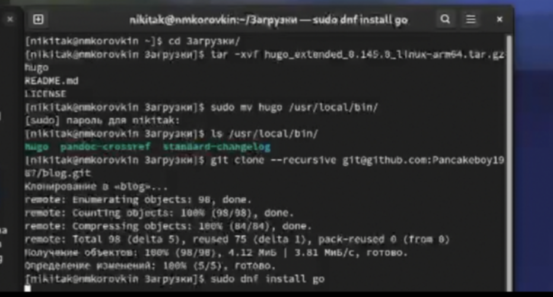
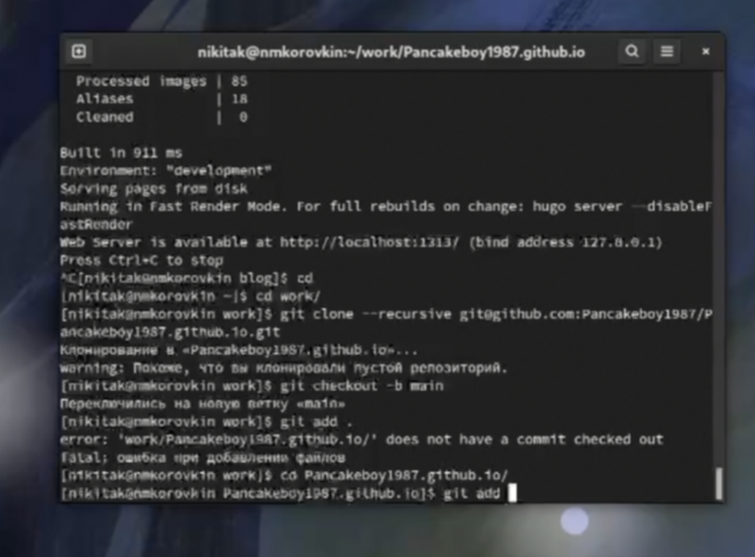

---
## Front matter
title: "Отчёт по индивидуальному проекту"
subtitle: "Часть 1"
author: "Коровкин Никита Михайлович"

## Generic otions
lang: ru-RU
toc-title: "Содержание"

## Bibliography
bibliography: bib/cite.bib
csl: pandoc/csl/gost-r-7-0-5-2008-numeric.csl

## Pdf output format
toc: true # Table of contents
toc-depth: 2
lof: true # List of figures
lot: true # List of tables
fontsize: 12pt
linestretch: 1.5
papersize: a4
documentclass: scrreprt
## I18n polyglossia
polyglossia-lang:
  name: russian
  options:
	- spelling=modern
	- babelshorthands=true
polyglossia-otherlangs:
  name: english
## I18n babel
babel-lang: russian
babel-otherlangs: english
## Fonts
mainfont: PT Serif
romanfont: PT Serif
sansfont: PT Sans
monofont: PT Mono
mainfontoptions: Ligatures=TeX
romanfontoptions: Ligatures=TeX
sansfontoptions: Ligatures=TeX,Scale=MatchLowercase
monofontoptions: Scale=MatchLowercase,Scale=0.9
## Biblatex
biblatex: true
biblio-style: "gost-numeric"
biblatexoptions:
  - parentracker=true
  - backend=biber
  - hyperref=auto
  - language=auto
  - autolang=other*
  - citestyle=gost-numeric
## Pandoc-crossref LaTeX customization
figureTitle: "Рис."
tableTitle: "Таблица"
listingTitle: "Листинг"
lofTitle: "Список иллюстраций"
lotTitle: "Список таблиц"
lolTitle: "Листинги"
## Misc options
indent: true
header-includes:
  - \usepackage{indentfirst}
  - \usepackage{float} # keep figures where there are in the text
  - \floatplacement{figure}{H} # keep figures where there are in the text
---

# Цель работы

Научиться создавать сайты с помощью Hugo и размещать их на хостинге github [@tuis]

# Задание

Установить необходимое программное обеспечение. 
Скачать шаблон темы сайта. 
Разместить его на хостинге git. 
Установить параметр для URLs сайта. 
Разместить заготовку сайта на Github pages.

# Выполнение лабораторной работы

Для начала установим  hugo(рис. [-@fig:001])

{#fig:001}

Затем перенесем распакованные файлы(рис. [-@fig:002])

{#fig:002}

Далее создаем репозиторий по шаблону(рис. [-@fig:003])

{#fig:003}

Клонируем репозиторий(рис. [-@fig:004])

{#fig:004}

Настраиваем Hugо(рис. [-@fig:005])

{#fig:005}

Создаем еще один репозиторий для сайта(рис. [-@fig:006])

{#fig:006}

Клонируем репозиторий(рис. [-@fig:007])

{#fig:007}

Делаем первый коммит(рис. [-@fig:008])

{#fig:008}

Сливаем все воедино (рис. [-@fig:009])

{#fig:009}

Делаем коммит(рис. [-@fig:010])

{#fig:010}

# Выводы

В результате выполнения лабораторной работы был создан сайт, который находится на хостинге Github

# Список литературы{.unnumbered}

::: {#refs}
:::
