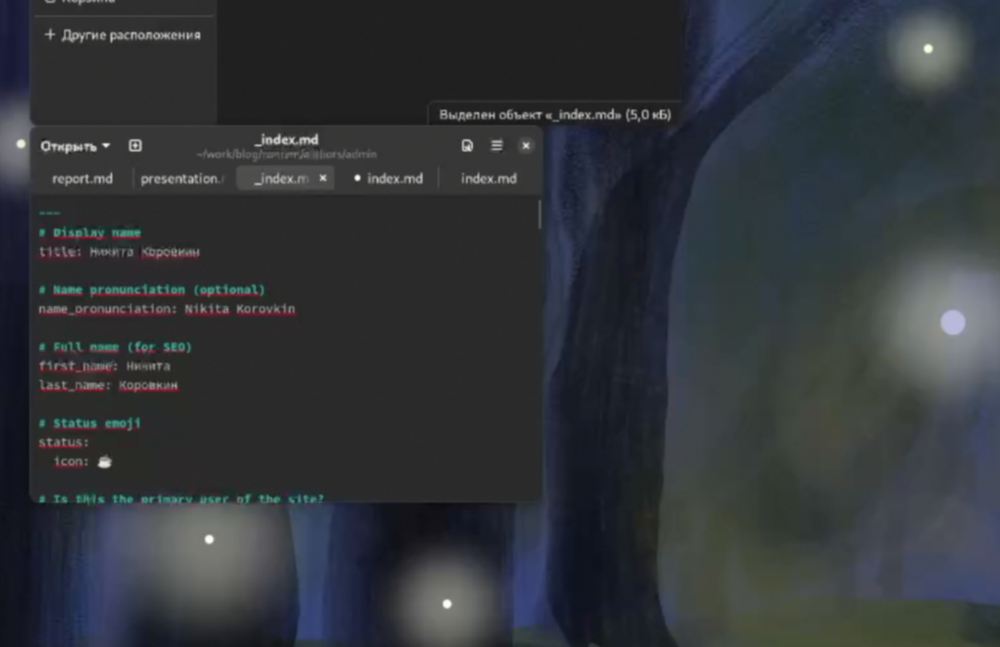
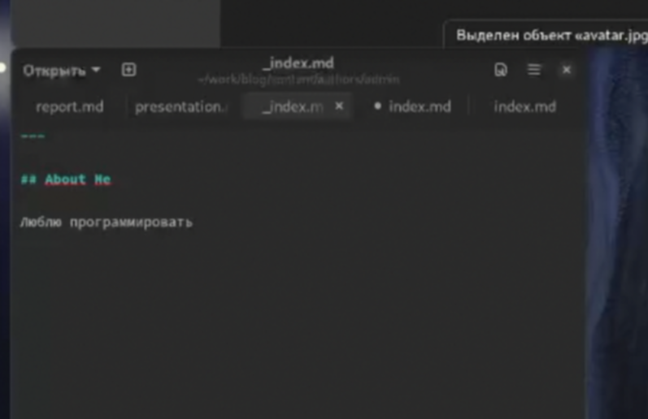
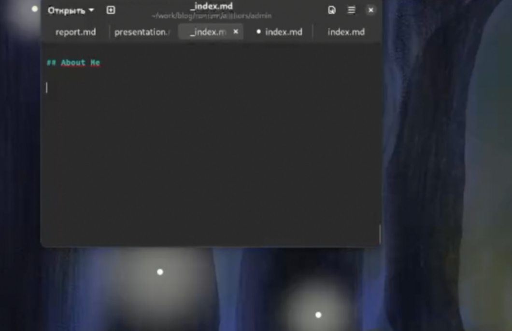
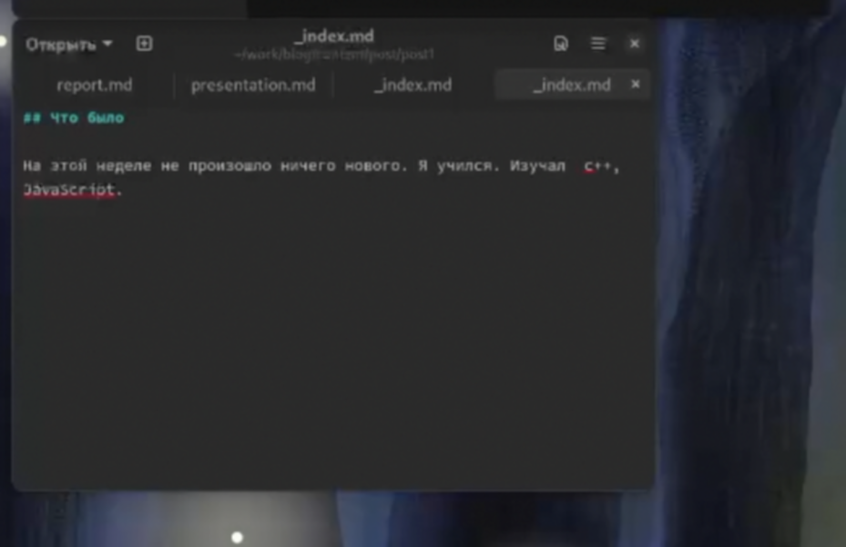
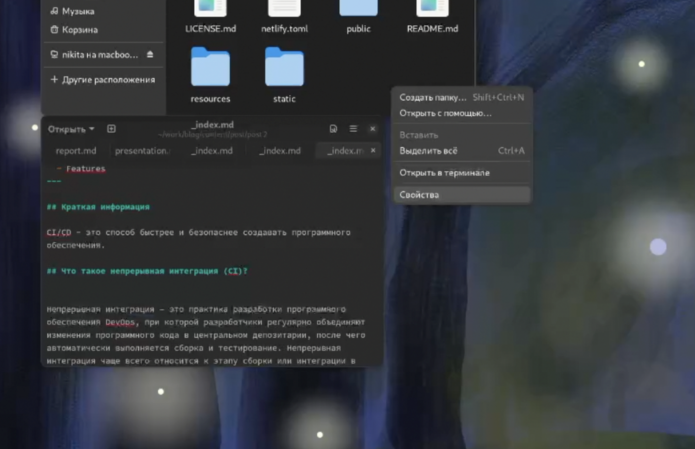
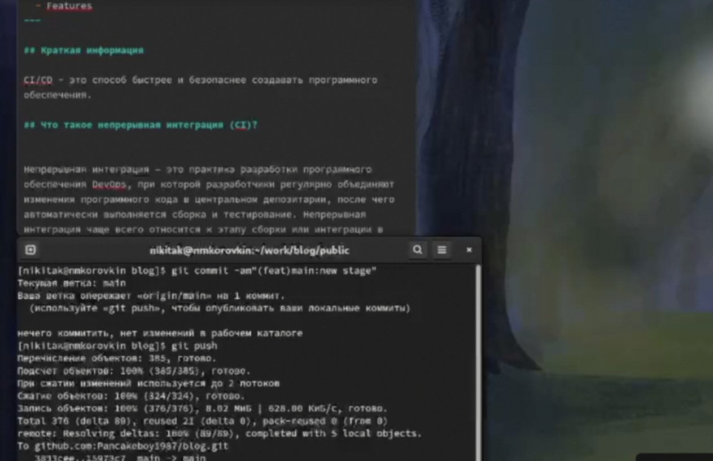

---
## Front matter
lang: ru-RU
title: Отчёт по индивидуальному проект
subtitle: Презентация
author:
  - Коровкин Н.М
institute:
  - Российский университет дружбы народов, Москва, Россия
date: 22 марта 2025

## i18n babel
babel-lang: russian
babel-otherlangs: english

## Formatting pdf
toc: false
toc-title: Содержание
slide_level: 2
aspectratio: 169
section-titles: true
theme: metropolis
header-includes:
 - \metroset{progressbar=frametitle,sectionpage=progressbar,numbering=fraction}
 - '\makeatletter'
 - '\beamer@ignorenonframefalse'
 - '\makeatother'
 
## Fonts
mainfont: PT Serif
romanfont: PT Serif
sansfont: PT Sans
monofont: PT Mono
mainfontoptions: Ligatures=TeX
romanfontoptions: Ligatures=TeX
sansfontoptions: Ligatures=TeX,Scale=MatchLowercase
monofontoptions: Scale=MatchLowercase,Scale=0.9
---

# Информация

## Докладчик

:::::::::::::: {.columns align=center}
::: {.column width="70%"}

  * Коровкин Никита Михайлович
  * Студент
  * Российский университет дружбы народов
  * [1132246835@pfur.ru](mailto:1132246835@pfur.ru)

:::
::: {.column width="30%"}

:::
::::::::::::::

## Цель

Создать индивидуальный сайт, постепенно его заполняя

## Задание

Разместить фотографию владельца сайта.
Разместить краткое описание владельца сайта (Biography).
Добавить информацию об интересах (Interests).
Добавить информацию от образовании (Education).
Сделать пост по прошедшей неделе.
Добавить пост на тему по выбору

## Выполнение лабораторной работы

Cперва я открою файл через который буду редактировать профиль

## Выполнение лабораторной работы

Теперь добавим фотографию 

## Выполнение лабораторной работы

Добавим там же информацию о себе, об интересах и об образовании 

## Выполнение лабораторной работы

Напишем пост о прошедшей неделе в папке posts

## Выполнение лабораторной работы

А после пост о CI/CD 

## Выполнение лабораторной работы

Теперь зальём изменения на github 

## Выводы

В результате выполнения лабораторной работы был создан сайт, который находится на хостинге Github

