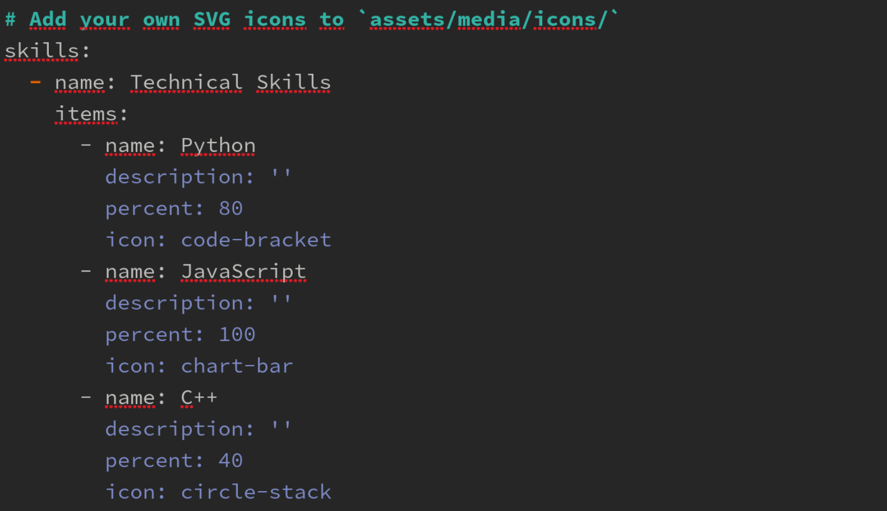
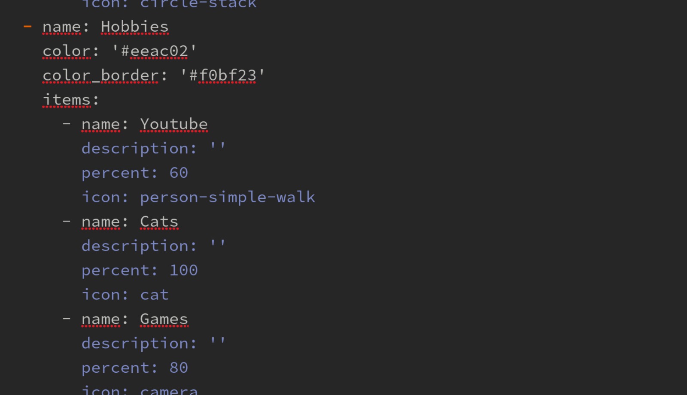
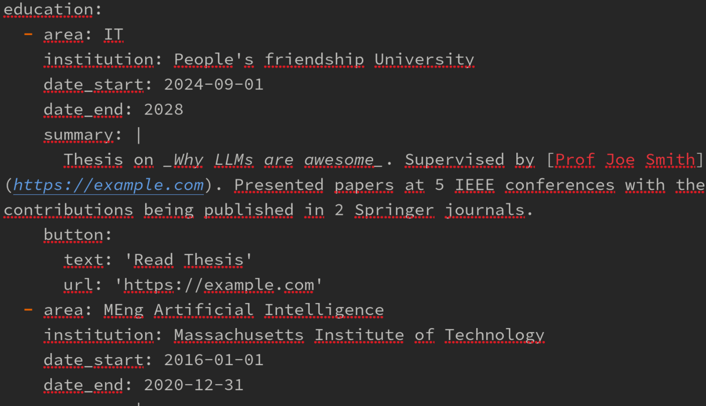
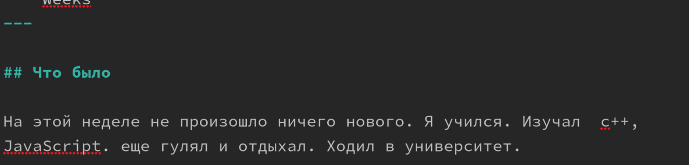
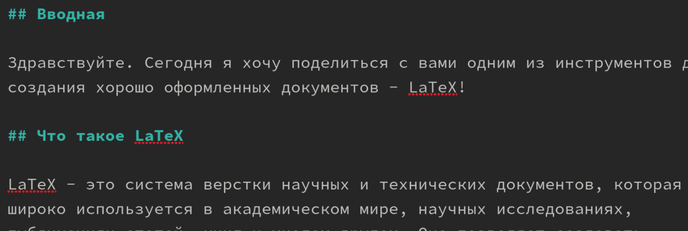

---
## Front matter
lang: ru-RU
title: Отчёт по индивидуальному проект
subtitle: Презентация
author:
  - Коровкин Н.М
institute:
  - Российский университет дружбы народов, Москва, Россия
date:11 april

## i18n babel
babel-lang: russian
babel-otherlangs: english

## Formatting pdf
toc: false
toc-title: Содержание
slide_level: 2
aspectratio: 169
section-titles: true
theme: metropolis
header-includes:
 - \metroset{progressbar=frametitle,sectionpage=progressbar,numbering=fraction}
 - '\makeatletter'
 - '\beamer@ignorenonframefalse'
 - '\makeatother'
 
## Fonts
mainfont: PT Serif
romanfont: PT Serif
sansfont: PT Sans
monofont: PT Mono
mainfontoptions: Ligatures=TeX
romanfontoptions: Ligatures=TeX
sansfontoptions: Ligatures=TeX,Scale=MatchLowercase
monofontoptions: Scale=MatchLowercase,Scale=0.9
---

# Информация

## Докладчик

:::::::::::::: {.columns align=center}
::: {.column width="70%"}

  * Коровкин Никита Михайлович
  * Студент
  * Российский университет дружбы народов
  * [1132246835@pfur.ru](mailto:1132246835@pfur.ru)

:::
::: {.column width="30%"}

:::
::::::::::::::

##Цель

Создать индивидуальный сайт, постепенно его заполняя

## Выполнение лабораторной работы

Добавим информацию о себе, о навыках рис. 

## Выполнение лабораторной работы

Добавим так же информацию о себе, о хобби рис. 

## Выполнение лабораторной работы

Добавим информацию о себе, о опыте рис. 

Напишем пост о прошедшей неделе в папке posts 

## Выполнение лабораторной работы

А после пост о LaTEX 

## Выполнение лабораторной работы

## Выводы

В результате выполнения лабораторной работы был создан сайт, который находится на хостинге Github

